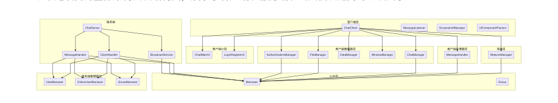

# Java Socket 聊天室

一个基于 Java Socket 的网络聊天室应用，采用 C/S（客户端/服务端）架构，支持私聊、群聊、文件传输等功能。


## 功能特性

- 用户认证
  - 用户注册
  - 用户登录
  - 找回密码
  - 重置密码

- 即时通讯
  - 私聊（点对点消息）
  - 群聊（多人群组消息）
  - 在线用户列表实时更新
  - 窗口抖动提醒

- 文件传输
  - 私聊文件发送/接收
  - 群聊文件发送/接收

- 群组管理
  - 创建群组
  - 搜索群组
  - 加入群组
  - 群组列表展示

- 个性化设置
  - 自定义聊天字体
  - 美化UI界面

## 技术栈

- **Java SE** - 核心编程语言
- **Java Swing** - GUI界面开发
- **Java Socket** - 网络通信
- **Java IO** - 数据传输
- **多线程** - 并发处理

## 项目结构

```
NewChatRoom/
├── src/
│   ├── common/                 # 公共类（客户端和服务端共享）
│   │   ├── Message.java        # 消息实体类
│   │   └── Group.java          # 群组实体类
│   ├── server/                 # 服务端代码
│   │   ├── ChatServer.java     # 服务端主类
│   │   ├── core/
│   │   │   └── ServerManager.java
│   │   ├── handlers/
│   │   │   ├── ClientHandler.java
│   │   │   └── MessageHandler.java
│   │   ├── managers/
│   │   │   ├── UserManager.java
│   │   │   └── GroupManager.java
│   │   └── broadcast/
│   │       └── BroadcastManager.java
│   └── client/                 # 客户端代码
│       ├── ChatClient.java     # 客户端主类
│       ├── network/
│       │   └── NetworkManager.java
│       ├── handler/
│       │   └── MessageHandler.java
│       └── ui/
│           ├── ChatMainUI.java
│           ├── LoginRegisterUI.java
│           └── UIComponentFactory.java
├── out/                        # 编译输出目录
├── learn.md                    # 从0开始开发教程
└── README.md                   # 项目说明文档
```

## 快速开始

### 环境要求

- JDK 8 或更高版本
- IntelliJ IDEA（推荐）或 Eclipse

### 运行方式

#### 方式一：使用 IntelliJ IDEA

1. 打开项目文件夹
2. 编译项目（Build → Build Project）
3. 运行服务端：`右键 ChatServer.java → Run`
4. 运行客户端：`右键 ChatClient.java → Run`（可运行多个实例）

#### 方式二：命令行编译运行

1. **编译项目**
```bash
# 创建输出目录
mkdir -p out/production/NewChatRoom

# 编译所有Java文件
javac -d out/production/NewChatRoom \
    src/common/*.java \
    src/server/*.java \
    src/server/*/*.java \
    src/client/*.java \
    src/client/*/*.java
```

2. **启动服务端**
```bash
cd out/production/NewChatRoom
java server.ChatServer
```

3. **启动客户端**
```bash
cd out/production/NewChatRoom
java client.ChatClient
```

## 使用说明

### 1. 登录界面

- 输入服务器IP（默认：127.0.0.1）
- 输入账号和密码
- 点击"登录"进入聊天室
- 新用户点击"注册"创建账号

### 2. 聊天界面

- **左侧**：在线用户列表和群组列表
- **中间**：聊天消息显示区域
- **底部**：消息输入框和发送按钮
- **顶部**：聊天类型选择（私聊/群聊）、目标选择、字体设置

### 3. 功能操作

| 功能 | 操作方式 |
|------|----------|
| 发送消息 | 输入内容后按回车或点击发送按钮 |
| 私聊 | 点击在线用户列表中的用户 |
| 群聊 | 从下拉框选择群组 |
| 发送文件 | 点击"选择文件"按钮 |
| 窗口抖动 | 点击"抖动"按钮 |
| 创建群组 | 点击"创建群"按钮 |
| 加入群组 | 点击"加入群"按钮 |

## 消息类型

```java
public enum Type {
    LOGIN,              // 登录
    PRIVATE_CHAT,       // 私聊
    GROUP_CHAT,         // 群聊
    ONLINE_NOTIFY,      // 上线通知
    OFFLINE_NOTIFY,     // 下线通知
    FILE_PRIVATE,       // 私聊文件
    FILE_GROUP,         // 群聊文件
    SHAKE,              // 窗口抖动
    CREATE_GROUP,       // 创建群组
    SEARCH_GROUP,       // 搜索群组
    JOIN_GROUP,         // 加入群组
    GROUP_LIST,         // 群组列表
    REGISTER,           // 注册
    FIND_PASSWORD,      // 找回密码
    RESET_PASSWORD      // 重置密码
}
```

## 网络架构

```
┌─────────────┐         ┌─────────────┐
│   Client    │◄───────►│   Server    │
│  (Swing UI) │  Socket │  (Port 8888)│
└─────────────┘         └─────────────┘
                               │
              ┌────────────────┼────────────────┐
              ▼                ▼                ▼
        ┌─────────┐      ┌─────────┐      ┌─────────┐
        │ Client  │      │ Client  │      │ Client  │
        │ Handler │      │ Handler │      │ Handler │
        └─────────┘      └─────────┘      └─────────┘
```

## 核心类说明

### 服务端

| 类名 | 说明 |
|------|------|
| `ChatServer` | 服务端主类，负责监听端口和接受连接 |
| `ClientHandler` | 客户端处理线程，处理单个客户端的消息 |
| `MessageHandler` | 消息处理器，处理各种消息类型的业务逻辑 |
| `UserManager` | 用户管理器，管理用户认证信息 |
| `GroupManager` | 群组管理器，管理群组信息 |
| `BroadcastManager` | 广播管理器，负责消息广播 |

### 客户端

| 类名 | 说明 |
|------|------|
| `ChatClient` | 客户端主类，程序入口 |
| `NetworkManager` | 网络管理器，处理连接和消息收发 |
| `MessageHandler` | 消息处理器，处理接收到的消息 |
| `LoginRegisterUI` | 登录注册界面 |
| `ChatMainUI` | 聊天主界面 |
| `UIComponentFactory` | UI组件工厂，创建美化组件 |

### 公共类

| 类名 | 说明 |
|------|------|
| `Message` | 消息实体类，用于网络传输 |
| `Group` | 群组实体类，包含群信息和成员列表 |

## 开发教程

详细的从0开始开发教程请查看 [learn.md](learn.md)，包含：

- 基础架构搭建
- 服务端开发详解
- 客户端开发详解
- 功能扩展实现
- 常见问题解决

## 待优化项

- [ ] 数据库持久化（用户信息和聊天记录）
- [ ] 文件断点续传
- [ ] 图片和表情支持
- [ ] 消息加密传输（SSL/TLS）
- [ ] 心跳机制检测在线状态
- [ ] 聊天记录本地保存

## 贡献指南

欢迎提交 Issue 和 Pull Request！

1. Fork 本仓库
2. 创建你的特性分支 (`git checkout -b feature/AmazingFeature`)
3. 提交你的修改 (`git commit -m 'Add some AmazingFeature'`)
4. 推送到分支 (`git push origin feature/AmazingFeature`)
5. 打开一个 Pull Request

## 许可证

本项目采用 MIT 许可证 - 详见 [LICENSE](LICENSE) 文件

## 联系方式

如有问题或建议，欢迎通过以下方式联系：

- 提交 Issue
- 发送邮件

---

**Happy Coding! 🚀**

