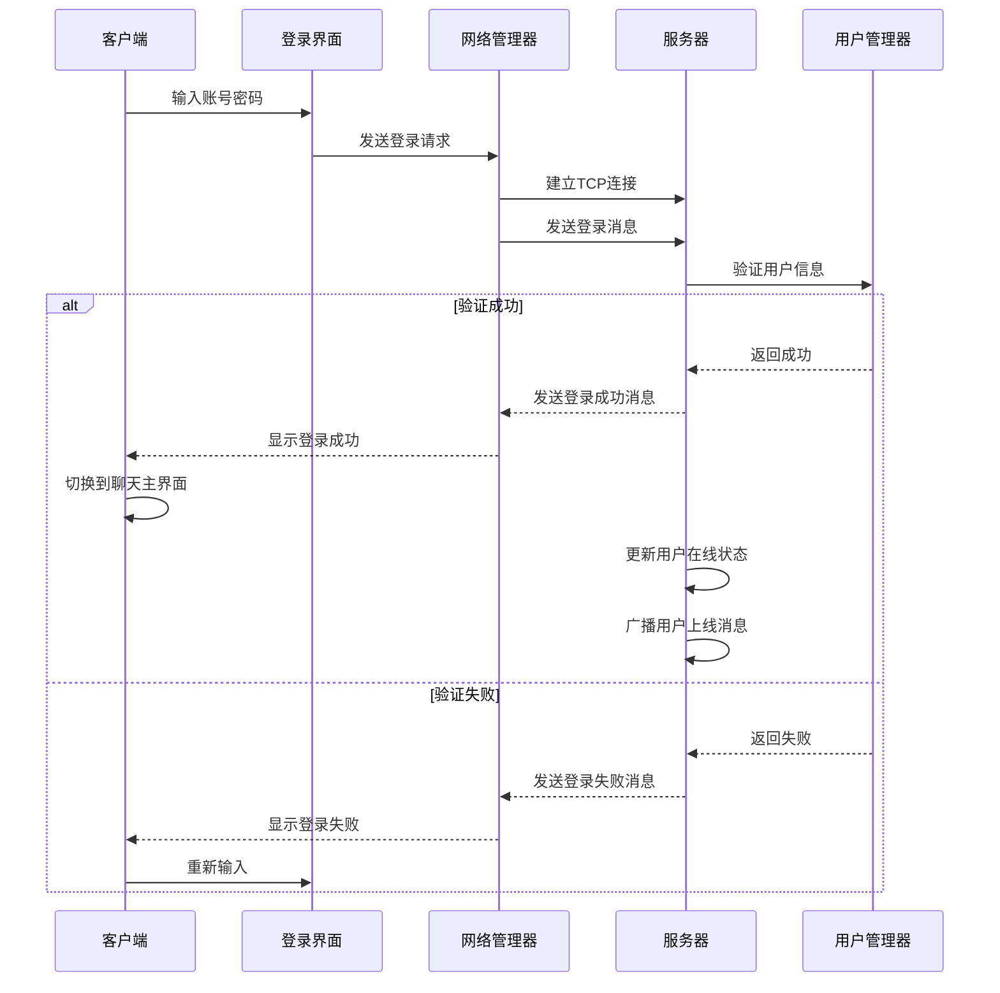
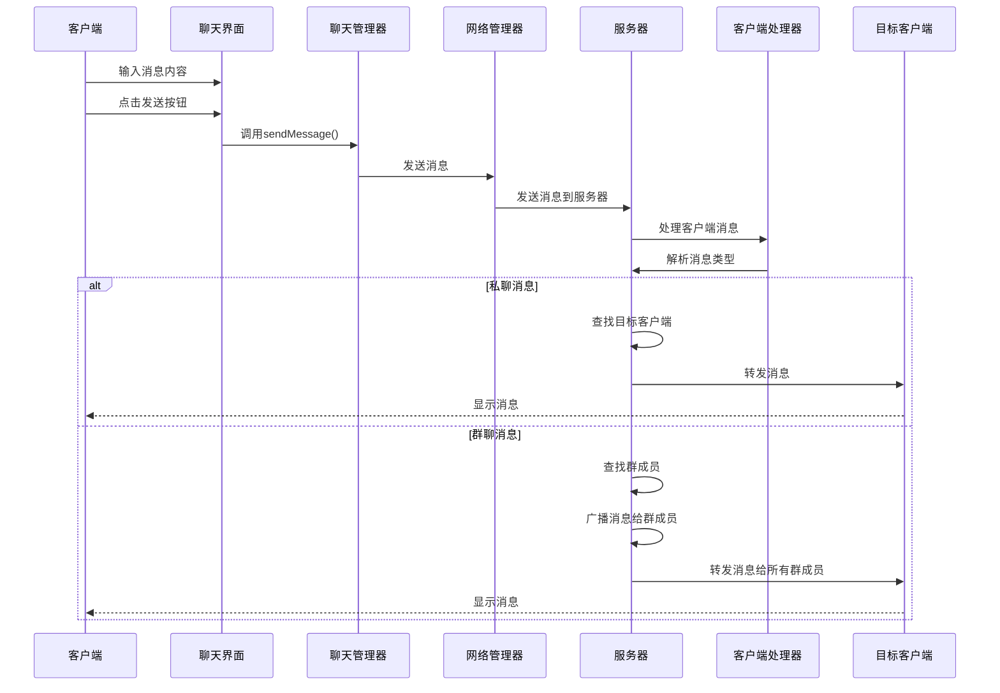
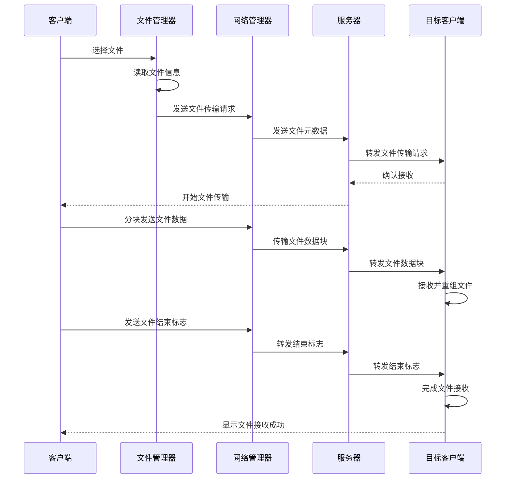

# Java 聊天室系统课程设计文档

## 1. 项目背景

### 1.1 项目简介

随着互联网技术的快速发展，实时通信已经成为人们日常生活和工作中不可或缺的一部分。从早期的IRC聊天到现代的微信、QQ等即时通讯工具，实时聊天系统的技术架构和用户体验不断演进。本课程设计旨在通过实现一个基于Java Socket的聊天室系统，深入理解网络编程、多线程并发、图形用户界面设计等核心计算机科学概念，培养学生的综合编程能力和系统设计能力。

### 1.2 技术背景

#### 1.2.1 网络通信技术

Java Socket编程是实现网络通信的基础技术，它提供了TCP/IP协议的高级抽象。通过Socket，应用程序可以在不同的计算机之间建立连接并进行数据传输。在本项目中，我们将使用Socket实现客户端与服务器之间的实时通信，包括文本消息、文件传输、窗口抖动等功能。

#### 1.2.2 多线程技术

实时聊天系统需要处理多个客户端的并发连接，因此多线程技术是必不可少的。服务器端需要为每个客户端连接创建独立的线程，以处理客户端的消息收发；客户端也需要使用线程来处理服务器发送的消息，以避免阻塞主线程的UI更新。

#### 1.2.3 图形用户界面技术

Swing是Java提供的用于构建图形用户界面的工具包。在本项目中，我们将使用Swing构建美观、易用的客户端界面，包括登录注册界面、聊天主界面、文件传输界面等。通过自定义组件和布局管理器，我们将实现类似微信风格的现代化界面。

#### 1.2.4 面向对象编程

面向对象编程是Java的核心编程范式，它通过封装、继承、多态等特性，使代码更加模块化、可维护、可扩展。在本项目中，我们将采用面向对象的设计思想，将系统划分为多个模块，每个模块由相应的类负责，实现高内聚、低耦合的设计目标。

### 1.3 项目意义

1. **理论联系实际**：将课堂上学到的网络编程、多线程、GUI设计等理论知识应用到实际项目中，加深对这些概念的理解。

2. **培养综合能力**：通过完整的项目开发流程，培养学生的需求分析、系统设计、编码实现、测试调试等综合能力。

3. **团队协作**：项目的复杂性要求学生之间进行有效的沟通和协作，培养团队合作精神。

4. **技术创新**：在实现基本功能的基础上，鼓励学生进行技术创新，如添加新功能、优化性能、改进用户体验等。

5. **就业竞争力**：完整的项目经验和技术栈将大大提高学生的就业竞争力，特别是在软件开发、网络通信等领域。

## 2. 系统需求分析

### 2.1 功能需求

#### 2.1.1 客户端功能

1. **用户认证**
   - 登录功能：用户输入账号和密码进行登录
   - 注册功能：新用户可以注册新账号
   - 找回密码：用户可以通过验证找回密码
   - 服务器IP配置：用户可以配置连接的服务器IP地址

2. **聊天功能**
   - 私聊：用户之间的一对一聊天
   - 群聊：用户可以创建和加入群聊，进行多人聊天
   - 消息历史：显示聊天消息历史记录
   - 消息输入：支持文本消息输入和发送

3. **文件传输**
   - 私聊文件传输：向特定用户发送文件
   - 群聊文件传输：向群聊发送文件
   - 文件接收：接收其他用户发送的文件
   - 文件大小限制：支持较大文件的传输

4. **高级功能**
   - 窗口抖动：向其他用户发送窗口抖动
   - 截图发送：支持屏幕截图并发送
   - 字体设置：支持设置聊天字体
   - 在线状态：显示用户在线状态

5. **界面功能**
   - 微信风格界面：现代化、美观的用户界面
   - 响应式设计：适应不同屏幕尺寸
   - 动画效果：添加适当的动画效果提升用户体验
   - 错误提示：友好的错误提示信息

#### 2.1.2 服务器端功能

1. **连接管理**
   - 客户端连接管理：处理客户端的连接和断开
   - 并发处理：支持多个客户端的并发连接
   - 连接超时：处理客户端连接超时

2. **用户管理**
   - 用户认证：验证用户登录信息
   - 用户注册：处理新用户注册
   - 密码找回：处理用户密码找回请求
   - 在线状态管理：维护用户在线状态

3. **消息处理**
   - 消息转发：将消息转发给目标用户或群聊
   - 消息广播：广播系统消息或用户状态变化
   - 消息存储：存储聊天消息历史

4. **群聊管理**
   - 群聊创建：处理用户创建群聊的请求
   - 群聊查找：支持按群名或ID查找群聊
   - 群聊加入：处理用户加入群聊的请求
   - 群成员管理：管理群聊成员列表

5. **文件传输**
   - 文件中转：中转客户端之间的文件传输
   - 文件管理：管理传输中的文件

### 2.2 非功能需求

#### 2.2.1 性能需求

1. **响应时间**：消息发送和接收的响应时间不超过1秒
2. **并发处理**：服务器能够同时处理至少50个客户端连接
3. **文件传输速度**：局域网内文件传输速度不低于1MB/s
4. **内存占用**：客户端内存占用不超过100MB

#### 2.2.2 可靠性需求

1. **连接稳定性**：网络波动时保持连接稳定
2. **消息可靠性**：确保消息不丢失、不重复
3. **错误处理**：优雅处理各种异常情况
4. **系统稳定性**：长时间运行无内存泄漏

#### 2.2.3 安全性需求

1. **密码安全**：密码加密存储
2. **消息安全**：消息传输加密
3. **防注入攻击**：防止SQL注入等常见攻击
4. **访问控制**：合理的权限控制机制

#### 2.2.4 可维护性需求

1. **代码可读性**：清晰的代码结构和注释
2. **模块化设计**：高度模块化的系统架构
3. **可扩展性**：易于添加新功能
4. **可测试性**：便于单元测试和集成测试

#### 2.2.5 可用性需求

1. **用户友好性**：直观、易用的用户界面
2. **错误提示**：清晰、友好的错误提示
3. **帮助文档**：完整的用户帮助文档
4. **兼容性**：支持不同版本的Java运行环境

### 2.3 数据需求

#### 2.3.1 客户端数据

1. **用户信息**：账号、密码、在线状态
2. **聊天记录**：消息内容、发送时间、发送者、接收者
3. **群聊信息**：群ID、群名称、群成员列表
4. **系统配置**：服务器IP、字体设置、窗口大小

#### 2.3.2 服务器端数据

1. **用户数据**：账号、密码、注册时间
2. **群聊数据**：群ID、群名称、创建时间、创建者
3. **在线用户**：当前在线用户列表
4. **消息队列**：待处理的消息队列

### 2.4 范围限定

1. **技术栈**：仅使用Java标准库和Swing，不使用第三方框架
2. **网络环境**：支持局域网和互联网环境
3. **文件大小**：单次文件传输大小限制为100MB
4. **并发用户**：最大支持50个并发用户
5. **界面语言**：中文界面

## 3. 系统总体设计

### 3.1 架构设计

#### 3.1.1 系统架构

本系统采用经典的客户端-服务器架构（Client-Server Architecture），分为客户端和服务器端两个主要部分。

**客户端**：负责用户界面显示、用户输入处理、消息发送和接收、文件传输等功能。采用MVC（Model-View-Controller）设计模式，将界面（View）、数据（Model）和业务逻辑（Controller）分离。

**服务器端**：负责客户端连接管理、消息转发、用户认证、群聊管理等功能。采用多线程并发模型，为每个客户端连接创建独立的线程进行处理。

#### 3.1.2 网络架构

- **传输层协议**：使用TCP协议，确保数据传输的可靠性
- **通信端口**：默认使用8888端口
- **数据格式**：使用Java对象序列化进行数据传输
- **心跳机制**：实现心跳机制检测客户端在线状态

#### 3.1.3 模块划分

**客户端模块**：
- `client.ChatClient`：客户端主类，负责初始化和协调各个模块
- `client.network.NetworkManager`：网络管理模块，负责与服务器的通信
- `client.ui`：用户界面模块，包括登录注册界面和聊天主界面
- `client.managers`：业务管理模块，包括聊天管理、文件管理、认证管理等
- `client.handler`：消息处理模块，负责处理服务器发送的消息
- `client.utils`：工具模块，提供文件操作等通用功能

**服务器端模块**：
- `server.ChatServer`：服务器主类，负责监听客户端连接
- `server.handlers.ClientHandler`：客户端处理模块，为每个客户端连接创建独立线程
- `server.managers`：管理模块，包括用户管理、群聊管理、在线用户管理等
- `server.broadcast`：广播模块，负责消息广播

**公共模块**：
- `common.Message`：消息类，定义消息的格式和类型
- `common.Group`：群聊类，定义群聊的属性和方法

### 3.2 目录结构

```
src/
├── client/                # 客户端代码
│   ├── handler/          # 消息处理器
│   │   └── MessageHandler.java
│   ├── managers/         # 业务管理器
│   │   ├── AuthenticationManager.java
│   │   ├── ChatManager.java
│   │   ├── DataManager.java
│   │   ├── FileManager.java
│   │   └── WindowManager.java
│   ├── network/          # 网络模块
│   │   └── NetworkManager.java
│   ├── ui/               # 用户界面
│   │   ├── ChatMainUI.java
│   │   ├── LoginRegisterUI.java
│   │   └── UIComponentFactory.java
│   ├── utils/            # 工具类
│   │   └── FileUtils.java
│   ├── ChatClient.java   # 客户端主类
│   ├── MessageListener.java
│   └── ScreenshotManager.java
├── common/               # 公共代码
│   ├── Group.java
│   └── Message.java
└── server/               # 服务器代码
    ├── broadcast/        # 广播服务
    │   └── BroadcastService.java
    ├── handlers/         # 处理器
    │   ├── ClientHandler.java
    │   └── MessageHandler.java
    ├── managers/         # 管理器
    │   ├── GroupManager.java
    │   ├── OnlineUserManager.java
    │   └── UserManager.java
    └── ChatServer.java   # 服务器主类
```

### 3.3 核心流程图

#### 3.3.1 客户端登录流程



#### 3.3.2 消息发送流程



#### 3.3.3 文件传输流程



### 3.4 关键类设计

#### 3.4.1 客户端关键类

| 类名 | 所在包 | 主要职责 | 核心方法 |
|------|--------|----------|----------|
| `ChatClient` | `client` | 客户端主类，协调各模块 | `showLoginRegisterFrame()`, `initChatUI()`, `sendMessage()` |
| `NetworkManager` | `client.network` | 网络通信管理 | `connectToServer()`, `sendMessage()`, `receiveMessage()` |
| `ChatManager` | `client.managers` | 聊天消息管理 | `sendMessage()`, `sendShake()` |
| `FileManager` | `client.managers` | 文件传输管理 | `selectFile()`, `sendFile()`, `receiveFile()` |
| `MessageHandler` | `client.handler` | 消息处理 | `handleMessage()` |
| `ChatMainUI` | `client.ui` | 聊天主界面 | `initChatUI()`, `updateUserList()`, `updateGroupList()` |
| `UIComponentFactory` | `client.ui` | UI组件工厂 | `createStyledButton()`, `createStyledTextField()` |

#### 3.4.2 服务器端关键类

| 类名 | 所在包 | 主要职责 | 核心方法 |
|------|--------|----------|----------|
| `ChatServer` | `server` | 服务器主类 | `startServer()`, `stopServer()` |
| `ClientHandler` | `server.handlers` | 客户端连接处理 | `run()`, `processMessage()` |
| `UserManager` | `server.managers` | 用户管理 | `authenticate()`, `registerUser()`, `findPassword()` |
| `GroupManager` | `server.managers` | 群聊管理 | `createGroup()`, `searchGroup()`, `joinGroup()` |
| `OnlineUserManager` | `server.managers` | 在线用户管理 | `addOnlineUser()`, `removeOnlineUser()`, `getOnlineUsers()` |
| `BroadcastService` | `server.broadcast` | 消息广播 | `broadcastMessage()`, `broadcastUserStatus()` |

#### 3.4.3 公共类

| 类名 | 所在包 | 主要职责 | 核心方法 |
|------|--------|----------|----------|
| `Message` | `common` | 消息类 | `getType()`, `getContent()`, `setContent()` |
| `Group` | `common` | 群聊类 | `getGroupId()`, `getGroupName()`, `getMembers()` |

### 3.5 数据结构设计

#### 3.5.1 消息类型

```java
public enum Type {
    // 系统消息
    LOGIN,               // 登录
    LOGIN_RESPONSE,      // 登录响应
    REGISTER,            // 注册
    REGISTER_RESPONSE,   // 注册响应
    FIND_PASSWORD,       // 找回密码
    FIND_PASSWORD_RESPONSE, // 找回密码响应
    RESET_PASSWORD,      // 重置密码
    RESET_PASSWORD_RESPONSE, // 重置密码响应
    GET_ONLINE_USERS,    // 获取在线用户
    ONLINE_USERS,        // 在线用户列表
    USER_ONLINE,         // 用户上线
    USER_OFFLINE,        // 用户下线
    
    // 聊天消息
    PRIVATE_CHAT,        // 私聊
    GROUP_CHAT,          // 群聊
    ONLINE_NOTIFY,       // 在线通知
    OFFLINE_NOTIFY,      // 离线通知
    
    // 文件传输
    FILE_PRIVATE,        // 私聊文件
    FILE_GROUP,          // 群聊文件
    
    // 高级功能
    SHAKE,               // 窗口抖动
    
    // 群聊操作
    CREATE_GROUP,        // 创建群聊
    CREATE_GROUP_RESPONSE, // 创建群聊响应
    SEARCH_GROUP,        // 查找群聊
    SEARCH_GROUP_RESPONSE, // 查找群聊响应
    JOIN_GROUP,          // 加入群聊
    JOIN_GROUP_RESPONSE, // 加入群聊响应
    GROUP_LIST,          // 群列表
    GROUP_LIST_RESPONSE, // 群列表响应
}
```

#### 3.5.2 消息结构

| 字段名 | 类型 | 描述 |
|--------|------|------|
| `type` | `Type` | 消息类型 |
| `sender` | `String` | 发送者账号 |
| `receiver` | `String` | 接收者账号或群ID |
| `content` | `String` | 消息内容 |
| `timestamp` | `long` | 发送时间戳 |
| `filePath` | `String` | 文件路径（文件传输时使用） |
| `fileName` | `String` | 文件名（文件传输时使用） |
| `fileSize` | `long` | 文件大小（文件传输时使用） |
| `fileData` | `byte[]` | 文件数据（文件传输时使用） |
| `groupList` | `List<Group>` | 群列表（服务器推送时使用） |

#### 3.5.3 群聊结构

| 字段名 | 类型 | 描述 |
|--------|------|------|
| `groupId` | `String` | 群ID |
| `groupName` | `String` | 群名称 |
| `creator` | `String` | 创建者账号 |
| `createTime` | `long` | 创建时间 |
| `members` | `List<String>` | 群成员列表 |

### 3.6 技术选型

| 类别 | 技术/库 | 版本 | 用途 | 选型理由 |
|------|---------|------|------|----------|
| 开发语言 | Java | 1.8+ | 主要开发语言 | 跨平台、面向对象、丰富的标准库 |
| 网络编程 | Java Socket | 内置 | 网络通信 | 稳定可靠，适合TCP通信 |
| 多线程 | Java Thread | 内置 | 并发处理 | 原生支持，易于实现 |
| 图形界面 | Swing | 内置 | 用户界面 | 内置库，无需额外依赖 |
| 数据存储 | 内存存储 | 内置 | 临时数据存储 | 简单高效，适合演示系统 |
| 序列化 | Java Serializable | 内置 | 对象序列化 | 简单易用，适合网络传输 |
| 工具库 | Java IO | 内置 | 文件操作 | 标准库，功能完善 |
| 构建工具 | javac | 内置 | 代码编译 | 简单直接，适合小型项目 |

### 3.7 性能设计

#### 3.7.1 并发处理

- **服务器端**：采用线程池管理客户端连接，避免频繁创建和销毁线程
- **客户端**：使用单独的线程处理消息接收，避免阻塞UI线程
- **消息队列**：实现消息队列，平滑处理消息峰值

#### 3.7.2 网络优化

- **消息压缩**：对较长消息进行压缩传输
- **批量发送**：合并短时间内的多个消息批量发送
- **心跳机制**：定期发送心跳包检测连接状态
- **断线重连**：实现自动断线重连机制

#### 3.7.3 内存管理

- **对象池**：复用频繁创建的对象
- **资源释放**：及时释放不再使用的资源
- **内存监控**：监控内存使用情况，防止内存泄漏

#### 3.7.4 界面优化

- **双缓冲**：使用双缓冲减少界面闪烁
- **异步更新**：UI更新在事件调度线程中进行
- **延迟加载**：非关键资源延迟加载

## 4. 详细模块设计

### 4.1 客户端模块

#### 4.1.1 ChatClient

**核心功能**：客户端主类，负责初始化和协调各个模块，是客户端的入口点。

**关键属性**：
- `networkManager`：网络管理器，负责与服务器通信
- `chatMainUI`：聊天主界面
- `username`：当前登录用户名
- `serverIp`：服务器IP地址

**关键方法**：
- `showLoginRegisterFrame()`：显示登录注册界面
- `initChatUI(String username)`：初始化聊天主界面
- `login(String account, String password)`：用户登录
- `register(String account, String password)`：用户注册
- `sendMessage()`：发送聊天消息
- `selectFile()`：选择文件发送
- `sendShakeMessage()`：发送窗口抖动
- `handleScreenshot()`：处理截图功能

**设计思路**：
- 采用单例模式，确保整个应用只有一个ChatClient实例
- 使用组合模式，将各个功能模块组合到ChatClient中
- 实现事件监听，处理用户界面事件
- 提供统一的接口供其他模块调用

#### 4.1.2 NetworkManager

**核心功能**：网络管理模块，负责与服务器的通信，包括连接建立、消息发送和接收。

**关键属性**：
- `socket`：与服务器的Socket连接
- `oos`：对象输出流，用于发送数据
- `ois`：对象输入流，用于接收数据
- `chatClient`：引用ChatClient实例

**关键方法**：
- `connectToServer()`：连接到服务器
- `disconnectFromServer()`：断开与服务器的连接
- `sendMessage(Message message)`：发送消息到服务器
- `receiveMessage()`：接收服务器发送的消息
- `isConnected()`：检查连接状态

**设计思路**：
- 封装Socket通信细节，提供简单的接口
- 处理网络异常，确保连接的稳定性
- 实现心跳机制，检测服务器连接状态
- 提供线程安全的消息发送和接收方法

#### 4.1.3 UI模块

**核心功能**：用户界面模块，负责登录注册界面和聊天主界面的显示和交互。

**UIComponentFactory**：
- **核心功能**：UI组件工厂，负责创建美化的UI组件
- **关键方法**：
  - `createStyledButton(String text)`：创建美化的按钮
  - `createStyledTextField()`：创建美化的文本输入框
  - `createStyledPasswordField()`：创建美化的密码输入框
  - `createRoundedPanel(Color bgColor, int padding)`：创建圆角面板

**ChatMainUI**：
- **核心功能**：聊天主界面，负责显示聊天消息和处理用户输入
- **关键属性**：
  - `chatArea`：聊天内容显示区
  - `inputField`：消息输入框
  - `chatTypeBox`：聊天类型选择（私聊/群聊）
  - `targetBox`：目标选择（用户/群聊）
  - `userList`：在线用户列表
  - `groupList`：群聊列表

- **关键方法**：
  - `initChatUI(String username)`：初始化聊天主界面
  - `updateUserList(List<String> onlineUsers)`：更新在线用户列表
  - `updateGroupList(List<Group> groupList)`：更新群聊列表

**LoginRegisterUI**：
- **核心功能**：登录注册界面，负责用户认证和注册
- **关键属性**：
  - `loginAccountField`：登录账号输入框
  - `loginPwdField`：登录密码输入框
  - `registerAccountField`：注册账号输入框
  - `registerPwdField`：注册密码输入框

- **关键方法**：
  - `showLoginPanel()`：显示登录面板
  - `showRegisterPanel()`：显示注册面板
  - `validateLoginInput()`：验证登录输入
  - `validateRegisterInput()`：验证注册输入

**设计思路**：
- 采用微信风格的现代化界面设计
- 使用BoxLayout和FlowLayout实现灵活的布局
- 实现自定义的圆角边框和按钮样式
- 提供响应式设计，适应不同屏幕尺寸

#### 4.1.4 Managers模块

**ChatManager**：
- **核心功能**：聊天管理模块，负责处理聊天消息的发送逻辑
- **关键方法**：
  - `sendMessage()`：发送聊天消息
  - `sendShake()`：发送窗口抖动
  - `sendCreateGroupRequest(String groupName)`：发送创建群聊请求
  - `sendSearchGroupRequest(String keyword)`：发送查找群聊请求
  - `sendJoinGroupRequest(String groupId)`：发送加入群聊请求

**FileManager**：
- **核心功能**：文件管理模块，负责文件传输功能
- **关键方法**：
  - `selectFile()`：选择要发送的文件
  - `sendFile(String target, String filePath)`：发送文件
  - `receiveFile(Message message)`：接收文件
  - `saveFile(byte[] fileData, String filePath)`：保存文件

**AuthenticationManager**：
- **核心功能**：认证管理模块，负责用户登录、注册和密码找回
- **关键方法**：
  - `login(String account, String password)`：用户登录
  - `register(String account, String password)`：用户注册
  - `findPassword(String account)`：找回密码
  - `resetPassword(String account, String newPassword)`：重置密码

**DataManager**：
- **核心功能**：数据管理模块，负责管理客户端数据
- **关键方法**：
  - `updateUserList(List<String> users)`：更新用户列表
  - `updateGroupList(List<Group> groups)`：更新群聊列表
  - `addChatMessage(String message)`：添加聊天消息
  - `getChatHistory()`：获取聊天历史

**WindowManager**：
- **核心功能**：窗口管理模块，负责窗口抖动等功能
- **关键方法**：
  - `shakeWindow(JFrame window)`：窗口抖动效果
  - `centerWindow(JFrame window)`：窗口居中
  - `setWindowSize(JFrame window, int width, int height)`：设置窗口大小

**设计思路**：
- 采用单一职责原则，每个管理器负责特定的功能
- 使用依赖注入，将ChatClient实例注入到各个管理器
- 实现线程安全的方法，确保多线程环境下的正确性
- 提供清晰的接口，方便其他模块调用

#### 4.1.5 Handler模块

**MessageHandler**：
- **核心功能**：消息处理模块，负责处理服务器发送的各种消息
- **关键方法**：
  - `handleMessage(Message message)`：处理消息
  - `handleChatMessage(Message message)`：处理聊天消息
  - `handleFileMessage(Message message)`：处理文件消息
  - `handleSystemMessage(Message message)`：处理系统消息
  - `handleGroupMessage(Message message)`：处理群聊相关消息

**设计思路**：
- 使用策略模式，根据消息类型选择不同的处理策略
- 实现异步处理，避免阻塞主线程
- 提供错误处理机制，确保消息处理的可靠性
- 与UI模块交互，更新用户界面

#### 4.1.6 Utils模块

**FileUtils**：
- **核心功能**：文件工具类，提供文件操作相关的工具方法
- **关键方法**：
  - `formatFileSize(long size)`：格式化文件大小
  - `getFileName(String filePath)`：获取文件名
  - `getExtension(String fileName)`：获取文件扩展名
  - `readFile(String filePath)`：读取文件
  - `writeFile(String filePath, byte[] data)`：写入文件

**设计思路**：
- 采用静态方法，方便直接调用
- 提供异常处理，确保文件操作的安全性
- 实现文件大小格式化，提高用户体验
- 支持大文件的读写操作

#### 4.1.7 ScreenshotManager

**核心功能**：截图管理模块，负责屏幕截图功能
- **关键方法**：
  - `captureScreen()`：捕获整个屏幕
  - `captureRegion(Rectangle region)`：捕获指定区域
  - `showScreenshotPreview(BufferedImage image)`：显示截图预览
  - `saveScreenshot(BufferedImage image, String filePath)`：保存截图

**设计思路**：
- 使用Robot类实现屏幕截图
- 提供截图区域选择功能
- 实现截图预览和编辑功能
- 支持截图的保存和发送

### 4.2 服务器端模块

#### 4.2.1 ChatServer

**核心功能**：服务器主类，负责监听客户端连接，管理客户端处理器。

**关键属性**：
- `serverSocket`：服务器Socket
- `clientHandlers`：客户端处理器列表
- `threadPool`：线程池
- `userManager`：用户管理器
- `groupManager`：群聊管理器
- `onlineUserManager`：在线用户管理器

**关键方法**：
- `startServer(int port)`：启动服务器
- `stopServer()`：停止服务器
- `acceptClient()`：接受客户端连接
- `broadcastMessage(Message message)`：广播消息
- `broadcastUserStatus(String username, boolean online)`：广播用户状态

**设计思路**：
- 采用多线程并发模型，为每个客户端连接创建独立线程
- 使用线程池管理线程，提高性能
- 实现服务器的启动和停止功能
- 提供消息广播机制

#### 4.2.2 ClientHandler

**核心功能**：客户端处理模块，为每个客户端连接创建独立线程，负责处理客户端的消息。

**关键属性**：
- `socket`：与客户端的Socket连接
- `username`：客户端用户名
- `chatServer`：引用ChatServer实例
- `isRunning`：线程运行状态

**关键方法**：
- `run()`：线程运行方法
- `processMessage(Message message)`：处理客户端消息
- `sendMessage(Message message)`：发送消息到客户端
- `closeConnection()`：关闭连接

**设计思路**：
- 为每个客户端连接创建独立线程
- 实现消息的接收和处理
- 处理客户端的各种请求
- 管理客户端的连接状态

#### 4.2.3 Managers模块

**UserManager**：
- **核心功能**：用户管理模块，负责用户认证、注册和密码管理
- **关键方法**：
  - `authenticate(String account, String password)`：用户认证
  - `registerUser(String account, String password)`：注册用户
  - `findPassword(String account)`：找回密码
  - `resetPassword(String account, String newPassword)`：重置密码
  - `getUser(String account)`：获取用户信息

**GroupManager**：
- **核心功能**：群聊管理模块，负责群聊的创建、查找和管理
- **关键方法**：
  - `createGroup(String groupName, String creator)`：创建群聊
  - `searchGroup(String keyword)`：查找群聊
  - `joinGroup(String groupId, String username)`：加入群聊
  - `getGroup(String groupId)`：获取群聊信息
  - `getGroupMembers(String groupId)`：获取群成员列表

**OnlineUserManager**：
- **核心功能**：在线用户管理模块，负责管理用户的在线状态
- **关键方法**：
  - `addOnlineUser(String username)`：添加在线用户
  - `removeOnlineUser(String username)`：移除在线用户
  - `isUserOnline(String username)`：检查用户是否在线
  - `getOnlineUsers()`：获取在线用户列表
  - `getOnlineUserCount()`：获取在线用户数量

**设计思路**：
- 采用内存存储，适合演示系统
- 实现用户认证和管理功能
- 提供群聊的创建和管理功能
- 管理用户的在线状态

#### 4.2.4 Broadcast模块

**BroadcastService**：
- **核心功能**：广播服务模块，负责消息广播
- **关键方法**：
  - `broadcastMessage(Message message, List<String> recipients)`：广播消息给指定用户
  - `broadcastToAll(Message message)`：广播消息给所有在线用户
  - `broadcastToGroup(Message message, String groupId)`：广播消息给群成员
  - `broadcastUserOnline(String username)`：广播用户上线消息
  - `broadcastUserOffline(String username)`：广播用户下线消息

**设计思路**：
- 实现消息的广播功能
- 支持向特定用户、所有用户和群成员广播
- 提供用户状态变更的广播
- 确保广播的可靠性和及时性

### 4.3 公共模块

#### 4.3.1 Message

**核心功能**：消息类，定义消息的格式和类型，是客户端和服务器之间通信的基本单位。

**关键属性**：
- `type`：消息类型
- `sender`：发送者
- `receiver`：接收者
- `content`：消息内容
- `timestamp`：时间戳
- `filePath`：文件路径
- `fileName`：文件名
- `fileSize`：文件大小
- `fileData`：文件数据
- `groupList`：群列表

**关键方法**：
- `getMessageType()`：获取消息类型
- `setMessageType(Type type)`：设置消息类型
- `getSender()`：获取发送者
- `setSender(String sender)`：设置发送者
- `getReceiver()`：获取接收者
- `setReceiver(String receiver)`：设置接收者
- `getContent()`：获取消息内容
- `setContent(String content)`：设置消息内容
- `getTimestamp()`：获取时间戳
- `setTimestamp(long timestamp)`：设置时间戳

**设计思路**：
- 实现Serializable接口，支持对象序列化
- 提供丰富的消息类型，满足不同的通信需求
- 支持文件传输功能
- 设计灵活的消息结构，便于扩展

#### 4.3.2 Group

**核心功能**：群聊类，定义群聊的属性和方法。

**关键属性**：
- `groupId`：群ID
- `groupName`：群名称
- `creator`：创建者
- `createTime`：创建时间
- `members`：群成员列表

**关键方法**：
- `getGroupId()`：获取群ID
- `setGroupId(String groupId)`：设置群ID
- `getGroupName()`：获取群名称
- `setGroupName(String groupName)`：设置群名称
- `getCreator()`：获取创建者
- `setCreator(String creator)`：设置创建者
- `getCreateTime()`：获取创建时间
- `setCreateTime(long createTime)`：设置创建时间
- `getMembers()`：获取群成员列表
- `setMembers(List<String> members)`：设置群成员列表
- `addMember(String username)`：添加群成员
- `removeMember(String username)`：移除群成员

**设计思路**：
- 实现Serializable接口，支持对象序列化
- 提供群聊的基本属性和方法
- 支持群成员的管理
- 设计简洁的群聊结构

## 5. 实现方案

### 5.1 开发环境搭建

#### 5.1.1 软件需求

- **JDK**：Java Development Kit 1.8或更高版本
- **IDE**：IntelliJ IDEA、Eclipse或NetBeans
- **操作系统**：Windows、macOS或Linux
- **网络环境**：局域网或互联网

#### 5.1.2 环境配置

1. **安装JDK**
   - 下载JDK 1.8或更高版本
   - 按照安装向导进行安装
   - 配置环境变量JAVA_HOME和PATH

2. **安装IDE**
   - 下载并安装IntelliJ IDEA Community Edition
   - 打开IDE，创建新的Java项目

3. **项目配置**
   - 创建项目目录结构
   - 配置源代码目录
   - 添加必要的依赖

### 5.2 客户端实现

#### 5.2.1 登录注册界面

**实现步骤**：
1. 创建`LoginRegisterUI.java`类
2. 设计登录面板和注册面板
3. 实现登录和注册功能
4. 添加表单验证
5. 实现找回密码功能

**关键代码**：
```java
public void showLoginRegisterFrame() {
    JFrame loginFrame = new JFrame("Java 聊天室");
    loginFrame.setSize(420, 550);
    loginFrame.setDefaultCloseOperation(JFrame.EXIT_ON_CLOSE);
    loginFrame.setLocationRelativeTo(null);
    loginFrame.setResizable(false);
    loginFrame.getContentPane().setBackground(new Color(245, 245, 245));

    JPanel mainPanel = new JPanel();
    mainPanel.setLayout(new BoxLayout(mainPanel, BoxLayout.Y_AXIS));
    mainPanel.setBackground(new Color(245, 245, 245));
    mainPanel.setBorder(BorderFactory.createEmptyBorder(50, 40, 40, 40));

    JLabel titleLabel = new JLabel("Java 聊天室");
    titleLabel.setFont(new Font("微软雅黑", Font.PLAIN, 26));
    titleLabel.setForeground(new Color(51, 51, 51));
    titleLabel.setAlignmentX(Component.CENTER_ALIGNMENT);
    mainPanel.add(titleLabel);
    mainPanel.add(Box.createVerticalStrut(50));

    // 服务器IP输入
    JLabel ipLabel = new JLabel("服务器IP");
    ipLabel.setFont(new Font("微软雅黑", Font.PLAIN, 12));
    ipLabel.setForeground(new Color(153, 153, 153));
    ipLabel.setAlignmentX(Component.LEFT_ALIGNMENT);
    mainPanel.add(ipLabel);
    mainPanel.add(Box.createVerticalStrut(8));

    JTextField serverIpField = new JTextField("127.0.0.1");
    serverIpField.setFont(new Font("微软雅黑", Font.PLAIN, 14));
    serverIpField.setMaximumSize(new Dimension(340, 42));
    serverIpField.setPreferredSize(new Dimension(340, 42));
    serverIpField.setAlignmentX(Component.LEFT_ALIGNMENT);
    mainPanel.add(serverIpField);
    mainPanel.add(Box.createVerticalStrut(20));

    // 账号输入
    JLabel accountLabel = new JLabel("账号");
    accountLabel.setFont(new Font("微软雅黑", Font.PLAIN, 12));
    accountLabel.setForeground(new Color(153, 153, 153));
    accountLabel.setAlignmentX(Component.LEFT_ALIGNMENT);
    mainPanel.add(accountLabel);
    mainPanel.add(Box.createVerticalStrut(8));

    JTextField accountField = new JTextField();
    accountField.setFont(new Font("微软雅黑", Font.PLAIN, 14));
    accountField.setMaximumSize(new Dimension(340, 42));
    accountField.setPreferredSize(new Dimension(340, 42));
    accountField.setAlignmentX(Component.LEFT_ALIGNMENT);
    mainPanel.add(accountField);
    mainPanel.add(Box.createVerticalStrut(20));

    // 密码输入
    JLabel pwdLabel = new JLabel("密码");
    pwdLabel.setFont(new Font("微软雅黑", Font.PLAIN, 12));
    pwdLabel.setForeground(new Color(153, 153, 153));
    pwdLabel.setAlignmentX(Component.LEFT_ALIGNMENT);
    mainPanel.add(pwdLabel);
    mainPanel.add(Box.createVerticalStrut(8));

    JPasswordField pwdField = new JPasswordField();
    pwdField.setFont(new Font("微软雅黑", Font.PLAIN, 14));
    pwdField.setMaximumSize(new Dimension(340, 42));
    pwdField.setPreferredSize(new Dimension(340, 42));
    pwdField.setAlignmentX(Component.LEFT_ALIGNMENT);
    mainPanel.add(pwdField);
    mainPanel.add(Box.createVerticalStrut(15));

    // 链接面板
    JPanel linkPanel = new JPanel(new FlowLayout(FlowLayout.LEFT, 0, 0));
    linkPanel.setBackground(new Color(245, 245, 245));
    linkPanel.setMaximumSize(new Dimension(340, 30));
    linkPanel.setAlignmentX(Component.LEFT_ALIGNMENT);

    JLabel findPwdLabel = new JLabel("找回密码");
    findPwdLabel.setFont(new Font("微软雅黑", Font.PLAIN, 12));
    findPwdLabel.setForeground(new Color(102, 102, 102));
    findPwdLabel.setCursor(new Cursor(Cursor.HAND_CURSOR));
    findPwdLabel.addMouseListener(new MouseAdapter() {
        @Override
        public void mouseClicked(MouseEvent e) {
            showFindPasswordDialog();
        }
        @Override
        public void mouseEntered(MouseEvent e) {
            findPwdLabel.setForeground(new Color(7, 193, 96));
        }
        @Override
        public void mouseExited(MouseEvent e) {
            findPwdLabel.setForeground(new Color(102, 102, 102));
        }
    });
    linkPanel.add(findPwdLabel);

    JLabel registerLabel = new JLabel("注册账号");
    registerLabel.setFont(new Font("微软雅黑", Font.PLAIN, 12));
    registerLabel.setForeground(new Color(102, 102, 102));
    registerLabel.setCursor(new Cursor(Cursor.HAND_CURSOR));
    registerLabel.addMouseListener(new MouseAdapter() {
        @Override
        public void mouseClicked(MouseEvent e) {
            showRegisterDialog();
        }
        @Override
        public void mouseEntered(MouseEvent e) {
            registerLabel.setForeground(new Color(7, 193, 96));
        }
        @Override
        public void mouseExited(MouseEvent e) {
            registerLabel.setForeground(new Color(102, 102, 102));
        }
    });
    linkPanel.add(Box.createHorizontalStrut(20));
    linkPanel.add(registerLabel);

    mainPanel.add(linkPanel);
    mainPanel.add(Box.createVerticalStrut(35));

    // 登录按钮
    JButton loginBtn = new JButton("登录");
    loginBtn.setFont(new Font("微软雅黑", Font.PLAIN, 16));
    loginBtn.setBackground(new Color(7, 193, 96));
    loginBtn.setForeground(Color.WHITE);
    loginBtn.setBorderPainted(false);
    loginBtn.setFocusPainted(false);
    loginBtn.setMaximumSize(new Dimension(340, 48));
    loginBtn.setPreferredSize(new Dimension(340, 48));
    loginBtn.setCursor(new Cursor(Cursor.HAND_CURSOR));
    loginBtn.setAlignmentX(Component.LEFT_ALIGNMENT);
    loginBtn.addActionListener(e -> {
        String ip = serverIpField.getText().trim();
        String account = accountField.getText().trim();
        String password = new String(pwdField.getPassword()).trim();
        if (account.isEmpty() || password.isEmpty()) {
            JOptionPane.showMessageDialog(loginFrame, "账号和密码不能为空！");
            return;
        }
        login(account, password);
    });
    mainPanel.add(loginBtn);

    loginFrame.setLayout(new BorderLayout());
    loginFrame.add(mainPanel, BorderLayout.CENTER);
    loginFrame.setVisible(true);
}
```

#### 5.2.2 聊天主界面

**实现步骤**：
1. 创建`ChatMainUI.java`类
2. 设计聊天主界面布局
3. 实现消息显示和输入功能
4. 添加用户列表和群聊列表
5. 实现文件传输和窗口抖动功能

**关键代码**：
```java
public void initChatUI(String username) {
    JFrame chatFrame = new JFrame("Java 聊天室");
    chatFrame.setSize(900, 600);
    chatFrame.setDefaultCloseOperation(JFrame.EXIT_ON_CLOSE);
    chatFrame.setLocationRelativeTo(null);

    // 左侧面板
    JPanel leftPanel = new JPanel(new BorderLayout());
    leftPanel.setPreferredSize(new Dimension(280, 0));
    leftPanel.setBackground(new Color(245, 245, 245));

    // 在线用户面板
    JPanel userPanel = new JPanel(new BorderLayout());
    userPanel.setBackground(new Color(245, 245, 245));
    userPanel.setBorder(BorderFactory.createEmptyBorder(10, 10, 10, 10));

    JLabel userTitleLabel = new JLabel("在线用户");
    userTitleLabel.setFont(new Font("微软雅黑", Font.BOLD, 13));
    userTitleLabel.setForeground(new Color(51, 51, 51));
    userPanel.add(userTitleLabel, BorderLayout.NORTH);

    DefaultListModel<String> userListModel = new DefaultListModel<>();
    JList<String> userList = new JList<>(userListModel);
    userList.setFont(new Font("微软雅黑", Font.PLAIN, 13));
    userList.setSelectionMode(ListSelectionModel.SINGLE_SELECTION);
    userList.setBackground(Color.WHITE);
    userList.setBorder(BorderFactory.createEmptyBorder(5, 10, 5, 10));
    userPanel.add(new JScrollPane(userList), BorderLayout.CENTER);

    // 群聊面板
    JPanel groupPanel = new JPanel(new BorderLayout());
    groupPanel.setBackground(new Color(245, 245, 245));
    groupPanel.setBorder(BorderFactory.createEmptyBorder(10, 10, 10, 10));

    JLabel groupTitleLabel = new JLabel("群聊列表");
    groupTitleLabel.setFont(new Font("微软雅黑", Font.BOLD, 13));
    groupTitleLabel.setForeground(new Color(51, 51, 51));
    groupPanel.add(groupTitleLabel, BorderLayout.NORTH);

    DefaultListModel<String> groupListModel = new DefaultListModel<>();
    JList<String> groupList = new JList<>(groupListModel);
    groupList.setFont(new Font("微软雅黑", Font.PLAIN, 13));
    groupList.setSelectionMode(ListSelectionModel.SINGLE_SELECTION);
    groupList.setBackground(Color.WHITE);
    groupList.setBorder(BorderFactory.createEmptyBorder(5, 10, 5, 10));
    groupPanel.add(new JScrollPane(groupList), BorderLayout.CENTER);

    // 群操作按钮
    JPanel groupBtnPanel = new JPanel(new FlowLayout(FlowLayout.LEFT, 5, 5));
    groupBtnPanel.setBackground(new Color(245, 245, 245));
    JButton createGroupBtn = new JButton("创建");
    createGroupBtn.setFont(new Font("微软雅黑", Font.PLAIN, 11));
    createGroupBtn.setBackground(new Color(7, 193, 96));
    createGroupBtn.setForeground(Color.WHITE);
    createGroupBtn.setBorderPainted(false);
    createGroupBtn.setFocusPainted(false);
    createGroupBtn.setPreferredSize(new Dimension(60, 28));
    groupBtnPanel.add(createGroupBtn);
    groupPanel.add(groupBtnPanel, BorderLayout.SOUTH);

    leftPanel.add(userPanel, BorderLayout.NORTH);
    leftPanel.add(groupPanel, BorderLayout.CENTER);

    // 右侧聊天面板
    JPanel chatMainPanel = new JPanel(new BorderLayout());
    chatMainPanel.setBackground(Color.WHITE);

    // 顶部工具栏
    JPanel topPanel = new JPanel(new BorderLayout());
    topPanel.setBackground(new Color(250, 250, 250));
    topPanel.setBorder(BorderFactory.createEmptyBorder(10, 15, 10, 15));
    topPanel.setPreferredSize(new Dimension(0, 50));

    JPanel typePanel = new JPanel(new FlowLayout(FlowLayout.LEFT, 10, 5));
    typePanel.setBackground(new Color(250, 250, 250));

    JLabel typeLabel = new JLabel("聊天类型：");
    typeLabel.setFont(new Font("微软雅黑", Font.PLAIN, 12));
    typeLabel.setForeground(new Color(102, 102, 102));
    typePanel.add(typeLabel);

    JComboBox<String> chatTypeBox = new JComboBox<>(new String[]{"群聊", "私聊"});
    chatTypeBox.setFont(new Font("微软雅黑", Font.PLAIN, 12));
    chatTypeBox.setBackground(Color.WHITE);
    typePanel.add(chatTypeBox);

    JLabel targetLabel = new JLabel("目标：");
    targetLabel.setFont(new Font("微软雅黑", Font.PLAIN, 12));
    targetLabel.setForeground(new Color(102, 102, 102));
    typePanel.add(targetLabel);

    JComboBox<String> targetBox = new JComboBox<>();
    targetBox.setFont(new Font("微软雅黑", Font.PLAIN, 12));
    targetBox.setBackground(Color.WHITE);
    typePanel.add(targetBox);

    topPanel.add(typePanel, BorderLayout.WEST);

    // 聊天区域
    JTextArea chatArea = new JTextArea();
    chatArea.setEditable(false);
    chatArea.setFont(new Font("微软雅黑", Font.PLAIN, 14));
    chatArea.setBackground(Color.WHITE);
    chatArea.setBorder(BorderFactory.createEmptyBorder(10, 15, 10, 15));
    JScrollPane scrollPane = new JScrollPane(chatArea);
    scrollPane.setBorder(null);

    // 底部输入区域
    JPanel bottomPanel = new JPanel(new BorderLayout());
    bottomPanel.setBackground(new Color(250, 250, 250));
    bottomPanel.setBorder(BorderFactory.createEmptyBorder(10, 15, 10, 15));
    bottomPanel.setPreferredSize(new Dimension(0, 80));

    JTextField inputField = new JTextField();
    inputField.setFont(new Font("微软雅黑", Font.PLAIN, 14));
    inputField.setBackground(Color.WHITE);
    inputField.setBorder(BorderFactory.createCompoundBorder(
        BorderFactory.createLineBorder(new Color(220, 220, 220)),
        BorderFactory.createEmptyBorder(8, 10, 8, 10)
    ));

    JPanel btnPanel = new JPanel(new FlowLayout(FlowLayout.LEFT, 8, 0));
    btnPanel.setBackground(new Color(250, 250, 250));

    JButton sendBtn = new JButton("发送");
    sendBtn.setFont(new Font("微软雅黑", Font.PLAIN, 13));
    sendBtn.setBackground(new Color(7, 193, 96));
    sendBtn.setForeground(Color.WHITE);
    sendBtn.setBorderPainted(false);
    sendBtn.setFocusPainted(false);
    sendBtn.setPreferredSize(new Dimension(70, 32));
    btnPanel.add(sendBtn);

    JButton fileBtn = new JButton("文件");
    fileBtn.setFont(new Font("微软雅黑", Font.PLAIN, 13));
    fileBtn.setBackground(new Color(7, 193, 96));
    fileBtn.setForeground(Color.WHITE);
    fileBtn.setBorderPainted(false);
    fileBtn.setFocusPainted(false);
    fileBtn.setPreferredSize(new Dimension(70, 32));
    btnPanel.add(fileBtn);

    JButton shakeBtn = new JButton("抖动");
    shakeBtn.setFont(new Font("微软雅黑", Font.PLAIN, 13));
    shakeBtn.setBackground(new Color(7, 193, 96));
    shakeBtn.setForeground(Color.WHITE);
    shakeBtn.setBorderPainted(false);
    shakeBtn.setFocusPainted(false);
    shakeBtn.setPreferredSize(new Dimension(70, 32));
    btnPanel.add(shakeBtn);

    bottomPanel.add(inputField, BorderLayout.CENTER);
    bottomPanel.add(btnPanel, BorderLayout.EAST);

    chatMainPanel.add(topPanel, BorderLayout.NORTH);
    chatMainPanel.add(scrollPane, BorderLayout.CENTER);
    chatMainPanel.add(bottomPanel, BorderLayout.SOUTH);

    chatFrame.add(leftPanel, BorderLayout.WEST);
    chatFrame.add(chatMainPanel, BorderLayout.CENTER);
    chatFrame.setVisible(true);
}
```

#### 5.2.3 网络通信

**实现步骤**：
1. 创建`NetworkManager.java`类
2. 实现与服务器的连接
3. 实现消息的发送和接收
4. 处理网络异常
5. 实现心跳机制

**关键代码**：
```java
public class NetworkManager {
    private Socket socket;
    private ObjectOutputStream oos;
    private ObjectInputStream ois;
    private ChatClient chatClient;
    private String serverIp;
    private int port = 8888;

    public NetworkManager(ChatClient chatClient, String serverIp) {
        this.chatClient = chatClient;
        this.serverIp = serverIp;
    }

    public boolean connectToServer() {
        try {
            socket = new Socket(serverIp, port);
            oos = new ObjectOutputStream(socket.getOutputStream());
            ois = new ObjectInputStream(socket.getInputStream());
            return true;
        } catch (Exception e) {
            e.printStackTrace();
            return false;
        }
    }

    public void sendMessage(Message message) {
        try {
            oos.writeObject(message);
            oos.flush();
        } catch (Exception e) {
            e.printStackTrace();
        }
    }

    public Message receiveMessage() {
        try {
            return (Message) ois.readObject();
        } catch (Exception e) {
            e.printStackTrace();
            return null;
        }
    }

    public void disconnectFromServer() {
        try {
            if (ois != null) ois.close();
            if (oos != null) oos.close();
            if (socket != null) socket.close();
        } catch (Exception e) {
            e.printStackTrace();
        }
    }

    public boolean isConnected() {
        return socket != null && socket.isConnected() && !socket.isClosed();
    }
}
```

#### 5.2.4 消息处理

**实现步骤**：
1. 创建`MessageHandler.java`类
2. 实现消息的解析和处理
3. 处理不同类型的消息
4. 更新用户界面

**关键代码**：
```java
public class MessageHandler {
    private ChatClient chatClient;
    private DataManager dataManager;

    public MessageHandler(ChatClient chatClient) {
        this.chatClient = chatClient;
        this.dataManager = new DataManager(chatClient);
    }

    public void handleMessage(Message message) {
        switch (message.getType()) {
            case LOGIN_RESPONSE:
                handleLoginResponse(message);
                break;
            case REGISTER_RESPONSE:
                handleRegisterResponse(message);
                break;
            case PRIVATE_CHAT:
            case GROUP_CHAT:
                handleChatMessage(message);
                break;
            case ONLINE_USERS:
                handleOnlineUsers(message);
                break;
            case USER_ONLINE:
            case USER_OFFLINE:
                handleUserStatus(message);
                break;
            case FILE_PRIVATE:
            case FILE_GROUP:
                handleFileMessage(message);
                break;
            case SHAKE:
                handleShakeMessage(message);
                break;
            case GROUP_LIST:
                handleGroupList(message);
                break;
            case CREATE_GROUP_RESPONSE:
            case JOIN_GROUP_RESPONSE:
                handleGroupResponse(message);
                break;
            default:
                break;
        }
    }

    private void handleChatMessage(Message message) {
        String sender = message.getSender();
        String content = message.getContent();
        String chatMessage = sender + ": " + content;
        chatClient.getChatArea().append(chatMessage + "\n");
    }

    private void handleFileMessage(Message message) {
        String sender = message.getSender();
        String fileName = message.getFileName();
        long fileSize = message.getFileSize();
        byte[] fileData = message.getFileData();
        
        String savePath = System.getProperty("user.home") + "/Downloads/" + fileName;
        try {
            FileUtils.writeFile(savePath, fileData);
            String messageText = sender + " 发送了文件：" + fileName + "（大小：" + FileUtils.formatFileSize(fileSize) + "）\n";
            chatClient.getChatArea().append(messageText);
        } catch (Exception e) {
            e.printStackTrace();
        }
    }

    private void handleShakeMessage(Message message) {
        WindowManager.shakeWindow(chatClient);
        String sender = message.getSender();
        String messageText = sender + " 发送了窗口抖动！\n";
        chatClient.getChatArea().append(messageText);
    }

    private void handleLoginResponse(Message message) {
        String content = message.getContent();
        if (content.contains("成功")) {
            chatClient.setUsername(message.getSender());
            chatClient.initChatUI(message.getSender());
        } else {
            JOptionPane.showMessageDialog(chatClient, content);
        }
    }

    private void handleRegisterResponse(Message message) {
        String content = message.getContent();
        JOptionPane.showMessageDialog(chatClient, content);
    }

    private void handleOnlineUsers(Message message) {
        List<String> users = message.getContent().split(",");
        dataManager.updateUserList(users);
    }

    private void handleUserStatus(Message message) {
        String username = message.getSender();
        boolean online = message.getType() == Message.Type.USER_ONLINE;
        String statusMessage = username + (online ? " 上线了" : " 下线了");
        chatClient.getChatArea().append(statusMessage + "\n");
    }

    private void handleGroupList(Message message) {
        List<Group> groups = message.getGroupList();
        dataManager.updateGroupList(groups);
    }

    private void handleGroupResponse(Message message) {
        String content = message.getContent();
        JOptionPane.showMessageDialog(chatClient, content);
    }
}
```

### 5.3 服务器端实现

#### 5.3.1 服务器主类

**实现步骤**：
1. 创建`ChatServer.java`类
2. 实现服务器的启动和停止
3. 处理客户端连接
4. 管理客户端处理器

**关键代码**：
```java
public class ChatServer {
    private ServerSocket serverSocket;
    private List<ClientHandler> clientHandlers;
    private ExecutorService threadPool;
    private UserManager userManager;
    private GroupManager groupManager;
    private OnlineUserManager onlineUserManager;

    public ChatServer() {
        clientHandlers = new ArrayList<>();
        threadPool = Executors.newCachedThreadPool();
        userManager = new UserManager();
        groupManager = new GroupManager();
        onlineUserManager = new OnlineUserManager();
    }

    public void startServer(int port) {
        try {
            serverSocket = new ServerSocket(port);
            System.out.println("服务器启动，监听端口：" + port);
            while (true) {
                Socket socket = serverSocket.accept();
                System.out.println("客户端连接：" + socket.getInetAddress());
                ClientHandler handler = new ClientHandler(socket, this);
                clientHandlers.add(handler);
                threadPool.execute(handler);
            }
        } catch (Exception e) {
            e.printStackTrace();
        }
    }

    public void stopServer() {
        try {
            for (ClientHandler handler : clientHandlers) {
                handler.closeConnection();
            }
            threadPool.shutdown();
            if (serverSocket != null) {
                serverSocket.close();
            }
            System.out.println("服务器停止");
        } catch (Exception e) {
            e.printStackTrace();
        }
    }

    public void broadcastMessage(Message message) {
        for (ClientHandler handler : clientHandlers) {
            if (handler.isRunning()) {
                handler.sendMessage(message);
            }
        }
    }

    public void broadcastMessage(Message message, String excludeUsername) {
        for (ClientHandler handler : clientHandlers) {
            if (handler.isRunning() && !handler.getUsername().equals(excludeUsername)) {
                handler.sendMessage(message);
            }
        }
    }

    public void broadcastToGroup(Message message, String groupId) {
        Group group = groupManager.getGroup(groupId);
        if (group != null) {
            List<String> members = group.getMembers();
            for (String member : members) {
                for (ClientHandler handler : clientHandlers) {
                    if (handler.isRunning() && handler.getUsername().equals(member)) {
                        handler.sendMessage(message);
                    }
                }
            }
        }
    }

    public void removeClientHandler(ClientHandler handler) {
        clientHandlers.remove(handler);
        String username = handler.getUsername();
        if (username != null) {
            onlineUserManager.removeOnlineUser(username);
            broadcastUserStatus(username, false);
        }
    }

    public void broadcastUserStatus(String username, boolean online) {
        Message message = new Message();
        message.setType(online ? Message.Type.USER_ONLINE : Message.Type.USER_OFFLINE);
        message.setSender(username);
        broadcastMessage(message);
    }

    public UserManager getUserManager() {
        return userManager;
    }

    public GroupManager getGroupManager() {
        return groupManager;
    }

    public OnlineUserManager getOnlineUserManager() {
        return onlineUserManager;
    }

    public static void main(String[] args) {
        ChatServer server = new ChatServer();
        server.startServer(8888);
    }
}
```

#### 5.3.2 客户端处理器

**实现步骤**：
1. 创建`ClientHandler.java`类
2. 实现客户端消息的接收和处理
3. 处理客户端的各种请求
4. 管理客户端的连接状态

**关键代码**：
```java
public class ClientHandler implements Runnable {
    private Socket socket;
    private ObjectInputStream ois;
    private ObjectOutputStream oos;
    private ChatServer chatServer;
    private String username;
    private boolean isRunning;

    public ClientHandler(Socket socket, ChatServer chatServer) {
        this.socket = socket;
        this.chatServer = chatServer;
        this.isRunning = true;
        try {
            this.oos = new ObjectOutputStream(socket.getOutputStream());
            this.ois = new ObjectInputStream(socket.getInputStream());
        } catch (Exception e) {
            e.printStackTrace();
            closeConnection();
        }
    }

    @Override
    public void run() {
        while (isRunning) {
            try {
                Message message = (Message) ois.readObject();
                processMessage(message);
            } catch (Exception e) {
                e.printStackTrace();
                closeConnection();
            }
        }
    }

    public void processMessage(Message message) {
        switch (message.getType()) {
            case LOGIN:
                handleLogin(message);
                break;
            case REGISTER:
                handleRegister(message);
                break;
            case PRIVATE_CHAT:
                handlePrivateChat(message);
                break;
            case GROUP_CHAT:
                handleGroupChat(message);
                break;
            case FILE_PRIVATE:
                handleFilePrivate(message);
                break;
            case FILE_GROUP:
                handleFileGroup(message);
                break;
            case SHAKE:
                handleShake(message);
                break;
            case CREATE_GROUP:
                handleCreateGroup(message);
                break;
            case SEARCH_GROUP:
                handleSearchGroup(message);
                break;
            case JOIN_GROUP:
                handleJoinGroup(message);
                break;
            case GET_ONLINE_USERS:
                handleGetOnlineUsers(message);
                break;
            default:
                break;
        }
    }

    private void handleLogin(Message message) {
        String account = message.getSender();
        String password = message.getContent();
        boolean success = chatServer.getUserManager().authenticate(account, password);
        Message response = new Message();
        response.setType(Message.Type.LOGIN_RESPONSE);
        response.setSender(account);
        if (success) {
            this.username = account;
            chatServer.getOnlineUserManager().addOnlineUser(account);
            chatServer.broadcastUserStatus(account, true);
            response.setContent("登录成功");
            sendOnlineUsers();
        } else {
            response.setContent("登录失败，账号或密码错误");
        }
        sendMessage(response);
    }

    private void handleRegister(Message message) {
        String account = message.getSender();
        String password = message.getContent();
        boolean success = chatServer.getUserManager().registerUser(account, password);
        Message response = new Message();
        response.setType(Message.Type.REGISTER_RESPONSE);
        response.setSender(account);
        response.setContent(success ? "注册成功" : "注册失败，账号已存在");
        sendMessage(response);
    }

    private void handlePrivateChat(Message message) {
        String receiver = message.getReceiver();
        for (ClientHandler handler : chatServer.getClientHandlers()) {
            if (handler.isRunning() && handler.getUsername().equals(receiver)) {
                handler.sendMessage(message);
                break;
            }
        }
    }

    private void handleGroupChat(Message message) {
        String groupId = message.getReceiver();
        chatServer.broadcastToGroup(message, groupId);
    }

    private void handleFilePrivate(Message message) {
        String receiver = message.getReceiver();
        for (ClientHandler handler : chatServer.getClientHandlers()) {
            if (handler.isRunning() && handler.getUsername().equals(receiver)) {
                handler.sendMessage(message);
                break;
            }
        }
    }

    private void handleFileGroup(Message message) {
        String groupId = message.getReceiver();
        chatServer.broadcastToGroup(message, groupId);
    }

    private void handleShake(Message message) {
        String receiver = message.getReceiver();
        for (ClientHandler handler : chatServer.getClientHandlers()) {
            if (handler.isRunning() && handler.getUsername().equals(receiver)) {
                handler.sendMessage(message);
                break;
            }
        }
    }

    private void handleCreateGroup(Message message) {
        String groupName = message.getContent();
        String creator = message.getSender();
        String groupId = chatServer.getGroupManager().createGroup(groupName, creator);
        Message response = new Message();
        response.setType(Message.Type.CREATE_GROUP_RESPONSE);
        response.setSender(creator);
        if (groupId != null) {
            response.setContent("创建群聊成功，群ID：" + groupId);
        } else {
            response.setContent("创建群聊失败");
        }
        sendMessage(response);
    }

    private void handleSearchGroup(Message message) {
        String keyword = message.getContent();
        List<Group> groups = chatServer.getGroupManager().searchGroup(keyword);
        Message response = new Message();
        response.setType(Message.Type.SEARCH_GROUP_RESPONSE);
        response.setSender(message.getSender());
        response.setGroupList(groups);
        sendMessage(response);
    }

    private void handleJoinGroup(Message message) {
        String groupId = message.getContent();
        String username = message.getSender();
        boolean success = chatServer.getGroupManager().joinGroup(groupId, username);
        Message response = new Message();
        response.setType(Message.Type.JOIN_GROUP_RESPONSE);
        response.setSender(username);
        response.setContent(success ? "加入群聊成功" : "加入群聊失败，群不存在或已加入");
        sendMessage(response);
    }

    private void handleGetOnlineUsers(Message message) {
        sendOnlineUsers();
    }

    private void sendOnlineUsers() {
        List<String> onlineUsers = chatServer.getOnlineUserManager().getOnlineUsers();
        String userList = String.join(",", onlineUsers);
        Message message = new Message();
        message.setType(Message.Type.ONLINE_USERS);
        message.setContent(userList);
        sendMessage(message);
    }

    public void sendMessage(Message message) {
        try {
            oos.writeObject(message);
            oos.flush();
        } catch (Exception e) {
            e.printStackTrace();
            closeConnection();
        }
    }

    public void closeConnection() {
        isRunning = false;
        try {
            if (ois != null) ois.close();
            if (oos != null) oos.close();
            if (socket != null) socket.close();
            chatServer.removeClientHandler(this);
        } catch (Exception e) {
            e.printStackTrace();
        }
    }

    public String getUsername() {
        return username;
    }

    public boolean isRunning() {
        return isRunning;
    }
}
```

#### 5.3.3 服务器管理器

**UserManager实现**：

**实现步骤**：
1. 创建`UserManager.java`类
2. 实现用户认证和注册功能
3. 管理用户数据

**关键代码**：
```java
public class UserManager {
    private Map<String, String> users; // 账号 -> 密码

    public UserManager() {
        users = new HashMap<>();
        // 添加默认测试用户
        users.put("admin", "123456");
        users.put("user1", "123456");
        users.put("user2", "123456");
    }

    /**
     * 用户认证
     * @param account 账号
     * @param password 密码
     * @return 是否认证成功
     */
    public boolean authenticate(String account, String password) {
        return users.containsKey(account) && users.get(account).equals(password);
    }

    /**
     * 注册用户
     * @param account 账号
     * @param password 密码
     * @return 是否注册成功
     */
    public boolean registerUser(String account, String password) {
        if (users.containsKey(account)) {
            return false;
        }
        users.put(account, password);
        return true;
    }

    /**
     * 找回密码
     * @param account 账号
     * @return 密码
     */
    public String findPassword(String account) {
        return users.get(account);
    }

    /**
     * 重置密码
     * @param account 账号
     * @param newPassword 新密码
     * @return 是否重置成功
     */
    public boolean resetPassword(String account, String newPassword) {
        if (!users.containsKey(account)) {
            return false;
        }
        users.put(account, newPassword);
        return true;
    }

    /**
     * 获取用户
     * @param account 账号
     * @return 密码
     */
    public String getUser(String account) {
        return users.get(account);
    }

    /**
     * 获取所有用户
     * @return 用户列表
     */
    public Set<String> getAllUsers() {
        return users.keySet();
    }
}
```

**GroupManager实现**：

**实现步骤**：
1. 创建`GroupManager.java`类
2. 实现群聊的创建、查找和管理功能
3. 管理群聊数据

**关键代码**：
```java
public class GroupManager {
    private Map<String, Group> groups; // 群ID -> 群聊

    public GroupManager() {
        groups = new HashMap<>();
    }

    /**
     * 创建群聊
     * @param groupName 群名称
     * @param creator 创建者
     * @return 群ID
     */
    public String createGroup(String groupName, String creator) {
        String groupId = "group_" + System.currentTimeMillis();
        Group group = new Group();
        group.setGroupId(groupId);
        group.setGroupName(groupName);
        group.setCreator(creator);
        group.setCreateTime(System.currentTimeMillis());
        List<String> members = new ArrayList<>();
        members.add(creator);
        group.setMembers(members);
        groups.put(groupId, group);
        return groupId;
    }

    /**
     * 查找群聊
     * @param keyword 关键字
     * @return 群聊列表
     */
    public List<Group> searchGroup(String keyword) {
        List<Group> result = new ArrayList<>();
        for (Group group : groups.values()) {
            if (group.getGroupName().contains(keyword)) {
                result.add(group);
            }
        }
        return result;
    }

    /**
     * 加入群聊
     * @param groupId 群ID
     * @param username 用户名
     * @return 是否加入成功
     */
    public boolean joinGroup(String groupId, String username) {
        Group group = groups.get(groupId);
        if (group == null) {
            return false;
        }
        List<String> members = group.getMembers();
        if (members.contains(username)) {
            return false;
        }
        members.add(username);
        return true;
    }

    /**
     * 获取群聊
     * @param groupId 群ID
     * @return 群聊
     */
    public Group getGroup(String groupId) {
        return groups.get(groupId);
    }

    /**
     * 获取群成员列表
     * @param groupId 群ID
     * @return 群成员列表
     */
    public List<String> getGroupMembers(String groupId) {
        Group group = groups.get(groupId);
        if (group == null) {
            return new ArrayList<>();
        }
        return group.getMembers();
    }

    /**
     * 获取所有群聊
     * @return 群聊列表
     */
    public List<Group> getAllGroups() {
        return new ArrayList<>(groups.values());
    }
}
```

**OnlineUserManager实现**：

**实现步骤**：
1. 创建`OnlineUserManager.java`类
2. 实现在线用户的管理功能
3. 维护用户在线状态

**关键代码**：
```java
public class OnlineUserManager {
    private Set<String> onlineUsers;

    public OnlineUserManager() {
        onlineUsers = new HashSet<>();
    }

    /**
     * 添加在线用户
     * @param username 用户名
     */
    public void addOnlineUser(String username) {
        onlineUsers.add(username);
    }

    /**
     * 移除在线用户
     * @param username 用户名
     */
    public void removeOnlineUser(String username) {
        onlineUsers.remove(username);
    }

    /**
     * 检查用户是否在线
     * @param username 用户名
     * @return 是否在线
     */
    public boolean isUserOnline(String username) {
        return onlineUsers.contains(username);
    }

    /**
     * 获取在线用户列表
     * @return 在线用户列表
     */
    public List<String> getOnlineUsers() {
        return new ArrayList<>(onlineUsers);
    }

    /**
     * 获取在线用户数量
     * @return 在线用户数量
     */
    public int getOnlineUserCount() {
        return onlineUsers.size();
    }
}
```

#### 5.3.4 广播服务

**实现步骤**：
1. 创建`BroadcastService.java`类
2. 实现消息广播功能
3. 支持不同类型的广播

**关键代码**：
```java
public class BroadcastService {
    private ChatServer chatServer;

    public BroadcastService(ChatServer chatServer) {
        this.chatServer = chatServer;
    }

    /**
     * 广播消息给指定用户
     * @param message 消息
     * @param recipients 接收者列表
     */
    public void broadcastMessage(Message message, List<String> recipients) {
        for (String recipient : recipients) {
            for (ClientHandler handler : chatServer.getClientHandlers()) {
                if (handler.isRunning() && handler.getUsername().equals(recipient)) {
                    handler.sendMessage(message);
                    break;
                }
            }
        }
    }

    /**
     * 广播消息给所有在线用户
     * @param message 消息
     */
    public void broadcastToAll(Message message) {
        chatServer.broadcastMessage(message);
    }

    /**
     * 广播消息给群成员
     * @param message 消息
     * @param groupId 群ID
     */
    public void broadcastToGroup(Message message, String groupId) {
        chatServer.broadcastToGroup(message, groupId);
    }

    /**
     * 广播用户上线消息
     * @param username 用户名
     */
    public void broadcastUserOnline(String username) {
        chatServer.broadcastUserStatus(username, true);
    }

    /**
     * 广播用户下线消息
     * @param username 用户名
     */
    public void broadcastUserOffline(String username) {
        chatServer.broadcastUserStatus(username, false);
    }
}
```

### 5.4 公共模块实现

#### 5.4.1 Message类实现

**实现步骤**：
1. 创建`Message.java`类
2. 定义消息类型枚举
3. 实现消息的属性和方法
4. 实现序列化接口

**关键代码**：
```java
import java.io.Serializable;
import java.util.List;

public class Message implements Serializable {
    private static final long serialVersionUID = 1L;

    public enum Type {
        // 系统消息
        LOGIN,               // 登录
        LOGIN_RESPONSE,      // 登录响应
        REGISTER,            // 注册
        REGISTER_RESPONSE,   // 注册响应
        FIND_PASSWORD,       // 找回密码
        FIND_PASSWORD_RESPONSE, // 找回密码响应
        RESET_PASSWORD,      // 重置密码
        RESET_PASSWORD_RESPONSE, // 重置密码响应
        GET_ONLINE_USERS,    // 获取在线用户
        ONLINE_USERS,        // 在线用户列表
        USER_ONLINE,         // 用户上线
        USER_OFFLINE,        // 用户下线
        
        // 聊天消息
        PRIVATE_CHAT,        // 私聊
        GROUP_CHAT,          // 群聊
        ONLINE_NOTIFY,       // 在线通知
        OFFLINE_NOTIFY,      // 离线通知
        
        // 文件传输
        FILE_PRIVATE,        // 私聊文件
        FILE_GROUP,          // 群聊文件
        
        // 高级功能
        SHAKE,               // 窗口抖动
        
        // 群聊操作
        CREATE_GROUP,        // 创建群聊
        CREATE_GROUP_RESPONSE, // 创建群聊响应
        SEARCH_GROUP,        // 查找群聊
        SEARCH_GROUP_RESPONSE, // 查找群聊响应
        JOIN_GROUP,          // 加入群聊
        JOIN_GROUP_RESPONSE, // 加入群聊响应
        GROUP_LIST,          // 群列表
        GROUP_LIST_RESPONSE, // 群列表响应
    }

    private Type type;
    private String sender;
    private String receiver;
    private String content;
    private long timestamp;
    private String filePath;
    private String fileName;
    private long fileSize;
    private byte[] fileData;
    private List<Group> groupList;

    public Message() {
        this.timestamp = System.currentTimeMillis();
    }

    public Type getType() {
        return type;
    }

    public void setType(Type type) {
        this.type = type;
    }

    public String getSender() {
        return sender;
    }

    public void setSender(String sender) {
        this.sender = sender;
    }

    public String getReceiver() {
        return receiver;
    }

    public void setReceiver(String receiver) {
        this.receiver = receiver;
    }

    public String getContent() {
        return content;
    }

    public void setContent(String content) {
        this.content = content;
    }

    public long getTimestamp() {
        return timestamp;
    }

    public void setTimestamp(long timestamp) {
        this.timestamp = timestamp;
    }

    public String getFilePath() {
        return filePath;
    }

    public void setFilePath(String filePath) {
        this.filePath = filePath;
    }

    public String getFileName() {
        return fileName;
    }

    public void setFileName(String fileName) {
        this.fileName = fileName;
    }

    public long getFileSize() {
        return fileSize;
    }

    public void setFileSize(long fileSize) {
        this.fileSize = fileSize;
    }

    public byte[] getFileData() {
        return fileData;
    }

    public void setFileData(byte[] fileData) {
        this.fileData = fileData;
    }

    public List<Group> getGroupList() {
        return groupList;
    }

    public void setGroupList(List<Group> groupList) {
        this.groupList = groupList;
    }

    @Override
    public String toString() {
        return "Message{" +
                "type=" + type +
                ", sender='" + sender + '\'' +
                ", receiver='" + receiver + '\'' +
                ", content='" + content + '\'' +
                ", timestamp=" + timestamp +
                '}';
    }
}
```

#### 5.4.2 Group类实现

**实现步骤**：
1. 创建`Group.java`类
2. 实现群聊的属性和方法
3. 实现序列化接口

**关键代码**：
```java
import java.io.Serializable;
import java.util.List;

public class Group implements Serializable {
    private static final long serialVersionUID = 1L;

    private String groupId;
    private String groupName;
    private String creator;
    private long createTime;
    private List<String> members;

    public String getGroupId() {
        return groupId;
    }

    public void setGroupId(String groupId) {
        this.groupId = groupId;
    }

    public String getGroupName() {
        return groupName;
    }

    public void setGroupName(String groupName) {
        this.groupName = groupName;
    }

    public String getCreator() {
        return creator;
    }

    public void setCreator(String creator) {
        this.creator = creator;
    }

    public long getCreateTime() {
        return createTime;
    }

    public void setCreateTime(long createTime) {
        this.createTime = createTime;
    }

    public List<String> getMembers() {
        return members;
    }

    public void setMembers(List<String> members) {
        this.members = members;
    }

    public void addMember(String username) {
        if (members != null && !members.contains(username)) {
            members.add(username);
        }
    }

    public void removeMember(String username) {
        if (members != null && members.contains(username)) {
            members.remove(username);
        }
    }

    @Override
    public String toString() {
        return "Group{" +
                "groupId='" + groupId + '\'' +
                ", groupName='" + groupName + '\'' +
                ", creator='" + creator + '\'' +
                ", createTime=" + createTime +
                ", members=" + members +
                '}';
    }
}
```

### 5.5 客户端工具类实现

#### 5.5.1 FileUtils类实现

**实现步骤**：
1. 创建`FileUtils.java`类
2. 实现文件操作相关的工具方法
3. 实现文件大小格式化等功能

**关键代码**：
```java
import java.io.*;

public class FileUtils {
    /**
     * 格式化文件大小
     * @param size 文件大小（字节）
     * @return 格式化后的文件大小
     */
    public static String formatFileSize(long size) {
        if (size < 1024) {
            return size + " B";
        } else if (size < 1024 * 1024) {
            return String.format("%.2f KB", size / 1024.0);
        } else if (size < 1024 * 1024 * 1024) {
            return String.format("%.2f MB", size / (1024.0 * 1024.0));
        } else {
            return String.format("%.2f GB", size / (1024.0 * 1024.0 * 1024.0));
        }
    }

    /**
     * 获取文件名
     * @param filePath 文件路径
     * @return 文件名
     */
    public static String getFileName(String filePath) {
        if (filePath == null) {
            return null;
        }
        int lastSeparatorIndex = filePath.lastIndexOf(File.separator);
        if (lastSeparatorIndex == -1) {
            return filePath;
        }
        return filePath.substring(lastSeparatorIndex + 1);
    }

    /**
     * 获取文件扩展名
     * @param fileName 文件名
     * @return 文件扩展名
     */
    public static String getExtension(String fileName) {
        if (fileName == null) {
            return null;
        }
        int lastDotIndex = fileName.lastIndexOf('.');
        if (lastDotIndex == -1) {
            return "";
        }
        return fileName.substring(lastDotIndex + 1).toLowerCase();
    }

    /**
     * 读取文件
     * @param filePath 文件路径
     * @return 文件数据
     * @throws IOException IO异常
     */
    public static byte[] readFile(String filePath) throws IOException {
        File file = new File(filePath);
        try (FileInputStream fis = new FileInputStream(file);
             ByteArrayOutputStream baos = new ByteArrayOutputStream()) {
            byte[] buffer = new byte[1024];
            int length;
            while ((length = fis.read(buffer)) != -1) {
                baos.write(buffer, 0, length);
            }
            return baos.toByteArray();
        }
    }

    /**
     * 写入文件
     * @param filePath 文件路径
     * @param data 文件数据
     * @throws IOException IO异常
     */
    public static void writeFile(String filePath, byte[] data) throws IOException {
        File file = new File(filePath);
        File parentDir = file.getParentFile();
        if (parentDir != null && !parentDir.exists()) {
            parentDir.mkdirs();
        }
        try (FileOutputStream fos = new FileOutputStream(file)) {
            fos.write(data);
        }
    }

    /**
     * 获取文件大小
     * @param filePath 文件路径
     * @return 文件大小
     */
    public static long getFileSize(String filePath) {
        File file = new File(filePath);
        return file.exists() ? file.length() : 0;
    }

    /**
     * 检查文件是否存在
     * @param filePath 文件路径
     * @return 是否存在
     */
    public static boolean exists(String filePath) {
        return new File(filePath).exists();
    }

    /**
     * 创建目录
     * @param dirPath 目录路径
     * @return 是否创建成功
     */
    public static boolean createDir(String dirPath) {
        File dir = new File(dirPath);
        return dir.exists() || dir.mkdirs();
    }
}
```

#### 5.5.2 WindowManager类实现

**实现步骤**：
1. 创建`WindowManager.java`类
2. 实现窗口抖动等功能

**关键代码**：
```java
import javax.swing.*;
import java.awt.*;

public class WindowManager {
    /**
     * 窗口抖动效果
     * @param window 窗口对象
     */
    public static void shakeWindow(Window window) {
        if (window == null || !window.isVisible()) {
            return;
        }

        final Point originalLocation = window.getLocation();
        final int shakeDistance = 10;
        final int shakeDuration = 500;
        final int shakeSteps = 20;

        Thread shakeThread = new Thread(() -> {
            for (int i = 0; i < shakeSteps; i++) {
                final int step = i;
                SwingUtilities.invokeLater(() -> {
                    int offsetX = (step % 2 == 0) ? shakeDistance : -shakeDistance;
                    int offsetY = (step % 2 == 0) ? shakeDistance : -shakeDistance;
                    window.setLocation(originalLocation.x + offsetX, originalLocation.y + offsetY);
                });
                try {
                    Thread.sleep(shakeDuration / shakeSteps);
                } catch (InterruptedException e) {
                    e.printStackTrace();
                }
            }
            SwingUtilities.invokeLater(() -> {
                window.setLocation(originalLocation);
            });
        });
        shakeThread.start();
    }

    /**
     * 窗口居中
     * @param window 窗口对象
     */
    public static void centerWindow(Window window) {
        if (window == null) {
            return;
        }
        Dimension screenSize = Toolkit.getDefaultToolkit().getScreenSize();
        int x = (screenSize.width - window.getWidth()) / 2;
        int y = (screenSize.height - window.getHeight()) / 2;
        window.setLocation(x, y);
    }

    /**
     * 设置窗口大小
     * @param window 窗口对象
     * @param width 宽度
     * @param height 高度
     */
    public static void setWindowSize(Window window, int width, int height) {
        if (window == null) {
            return;
        }
        window.setSize(width, height);
        centerWindow(window);
    }
}
```

#### 5.5.3 ScreenshotManager类实现

**实现步骤**：
1. 创建`ScreenshotManager.java`类
2. 实现屏幕截图功能
3. 支持区域截图和预览

**关键代码**：
```java
import javax.swing.*;
import java.awt.*;
import java.awt.image.BufferedImage;
import java.io.File;
import java.io.IOException;
import javax.imageio.ImageIO;

public class ScreenshotManager {
    /**
     * 捕获整个屏幕
     * @return 截图图像
     * @throws AWTException AWT异常
     */
    public static BufferedImage captureScreen() throws AWTException {
        Robot robot = new Robot();
        Dimension screenSize = Toolkit.getDefaultToolkit().getScreenSize();
        return robot.createScreenCapture(new Rectangle(screenSize));
    }

    /**
     * 捕获指定区域
     * @param region 区域
     * @return 截图图像
     * @throws AWTException AWT异常
     */
    public static BufferedImage captureRegion(Rectangle region) throws AWTException {
        Robot robot = new Robot();
        return robot.createScreenCapture(region);
    }

    /**
     * 显示截图预览
     * @param image 截图图像
     */
    public static void showScreenshotPreview(BufferedImage image) {
        JFrame previewFrame = new JFrame("截图预览");
        JLabel imageLabel = new JLabel(new ImageIcon(image));
        JScrollPane scrollPane = new JScrollPane(imageLabel);
        previewFrame.add(scrollPane);
        previewFrame.setSize(800, 600);
        WindowManager.centerWindow(previewFrame);
        previewFrame.setVisible(true);
    }

    /**
     * 保存截图
     * @param image 截图图像
     * @param filePath 文件路径
     * @throws IOException IO异常
     */
    public static void saveScreenshot(BufferedImage image, String filePath) throws IOException {
        File file = new File(filePath);
        File parentDir = file.getParentFile();
        if (parentDir != null && !parentDir.exists()) {
            parentDir.mkdirs();
        }
        ImageIO.write(image, "png", file);
    }

    /**
     * 获取默认截图保存路径
     * @return 默认路径
     */
    public static String getDefaultScreenshotPath() {
        String userHome = System.getProperty("user.home");
        return userHome + File.separator + "Desktop" + File.separator + "screenshot_" + System.currentTimeMillis() + ".png";
    }
}
```

## 6. 测试策略

### 6.1 测试目标

- **功能测试**：验证系统的各项功能是否正常工作
- **性能测试**：测试系统在不同负载下的性能表现
- **可靠性测试**：测试系统在各种异常情况下的稳定性
- **兼容性测试**：测试系统在不同环境下的兼容性
- **安全性测试**：测试系统的安全性

### 6.2 测试环境

| 环境类型 | 配置 | 用途 |
|---------|------|------|
| 开发环境 | JDK 1.8, IntelliJ IDEA | 开发和单元测试 |
| 测试环境 | JDK 1.8/11, Windows/macOS/Linux | 集成测试和系统测试 |
| 生产环境 | JDK 1.8+, 服务器 | 最终部署和性能测试 |

### 6.3 测试用例

#### 6.3.1 功能测试

**1. 登录注册功能测试**

| 测试用例ID | 测试场景 | 输入数据 | 预期结果 | 实际结果 | 状态 |
|-----------|---------|---------|----------|----------|------|
| TC-001 | 正常登录 | 账号：admin，密码：123456 | 登录成功，进入聊天界面 | - | 待测试 |
| TC-002 | 账号不存在 | 账号：nonexistent，密码：123456 | 登录失败，提示账号或密码错误 | - | 待测试 |
| TC-003 | 密码错误 | 账号：admin，密码：wrong | 登录失败，提示账号或密码错误 | - | 待测试 |
| TC-004 | 空账号 | 账号：""，密码：123456 | 登录失败，提示账号不能为空 | - | 待测试 |
| TC-005 | 空密码 | 账号：admin，密码："" | 登录失败，提示密码不能为空 | - | 待测试 |
| TC-006 | 正常注册 | 账号：newuser，密码：123456 | 注册成功，提示注册成功 | - | 待测试 |
| TC-007 | 账号已存在 | 账号：admin，密码：123456 | 注册失败，提示账号已存在 | - | 待测试 |

**2. 聊天功能测试**

| 测试用例ID | 测试场景 | 输入数据 | 预期结果 | 实际结果 | 状态 |
|-----------|---------|---------|----------|----------|------|
| TC-008 | 私聊消息 | 发送者：admin，接收者：user1，内容："Hello" | user1收到消息"admin: Hello" | - | 待测试 |
| TC-009 | 群聊消息 | 发送者：admin，群ID：group_123，内容："Hello everyone" | 群内所有成员收到消息 | - | 待测试 |
| TC-010 | 空消息 | 发送者：admin，接收者：user1，内容："" | 消息发送失败，提示消息不能为空 | - | 待测试 |
| TC-011 | 长消息 | 发送者：admin，接收者：user1，内容：1000个字符 | 消息发送成功，接收方完整显示 | - | 待测试 |

**3. 文件传输功能测试**

| 测试用例ID | 测试场景 | 输入数据 | 预期结果 | 实际结果 | 状态 |
|-----------|---------|---------|----------|----------|------|
| TC-012 | 小文件传输 | 发送者：admin，接收者：user1，文件：1KB.txt | 接收成功，文件保存到下载目录 | - | 待测试 |
| TC-013 | 大文件传输 | 发送者：admin，接收者：user1，文件：50MB.zip | 接收成功，文件保存到下载目录 | - | 待测试 |
| TC-014 | 群聊文件传输 | 发送者：admin，群ID：group_123，文件：test.txt | 群内所有成员收到文件 | - | 待测试 |

**4. 高级功能测试**

| 测试用例ID | 测试场景 | 输入数据 | 预期结果 | 实际结果 | 状态 |
|-----------|---------|---------|----------|----------|------|
| TC-015 | 窗口抖动 | 发送者：admin，接收者：user1 | user1窗口抖动，显示抖动提示 | - | 待测试 |
| TC-016 | 截图发送 | 发送者：admin，接收者：user1 | 截图成功发送，接收方显示图片 | - | 待测试 |
| TC-017 | 创建群聊 | 创建者：admin，群名称：测试群 | 创建成功，返回群ID | - | 待测试 |
| TC-018 | 加入群聊 | 用户名：user1，群ID：group_123 | 加入成功，提示加入群聊成功 | - | 待测试 |

#### 6.3.2 性能测试

**1. 并发连接测试**

| 测试用例ID | 测试场景 | 输入数据 | 预期结果 | 实际结果 | 状态 |
|-----------|---------|---------|----------|----------|------|
| TC-019 | 10个并发连接 | 10个客户端同时连接 | 所有客户端连接成功 | - | 待测试 |
| TC-020 | 30个并发连接 | 30个客户端同时连接 | 所有客户端连接成功 | - | 待测试 |
| TC-021 | 50个并发连接 | 50个客户端同时连接 | 所有客户端连接成功 | - | 待测试 |

**2. 消息处理性能测试**

| 测试用例ID | 测试场景 | 输入数据 | 预期结果 | 实际结果 | 状态 |
|-----------|---------|---------|----------|----------|------|
| TC-022 | 消息吞吐量 | 100条消息/秒 | 消息处理延迟 < 1秒 | - | 待测试 |
| TC-023 | 文件传输速度 | 10MB文件 | 局域网传输速度 > 1MB/s | - | 待测试 |

#### 6.3.3 可靠性测试

**1. 网络异常测试**

| 测试用例ID | 测试场景 | 输入数据 | 预期结果 | 实际结果 | 状态 |
|-----------|---------|---------|----------|----------|------|
| TC-024 | 网络中断 | 客户端发送消息时网络中断 | 自动重连，消息不丢失 | - | 待测试 |
| TC-025 | 服务器重启 | 客户端连接时服务器重启 | 自动重连，保持连接状态 | - | 待测试 |

**2. 异常处理测试**

| 测试用例ID | 测试场景 | 输入数据 | 预期结果 | 实际结果 | 状态 |
|-----------|---------|---------|----------|----------|------|
| TC-026 | 非法消息格式 | 发送不符合格式的消息 | 服务器正确处理，不崩溃 | - | 待测试 |
| TC-027 | 超大文件传输 | 发送1GB文件 | 服务器拒绝，客户端提示文件过大 | - | 待测试 |

#### 6.3.4 兼容性测试

**1. 不同JDK版本测试**

| 测试用例ID | 测试场景 | 输入数据 | 预期结果 | 实际结果 | 状态 |
|-----------|---------|---------|----------|----------|------|
| TC-028 | JDK 1.8 | 正常操作 | 所有功能正常 | - | 待测试 |
| TC-029 | JDK 11 | 正常操作 | 所有功能正常 | - | 待测试 |
| TC-030 | JDK 17 | 正常操作 | 所有功能正常 | - | 待测试 |

**2. 不同操作系统测试**

| 测试用例ID | 测试场景 | 输入数据 | 预期结果 | 实际结果 | 状态 |
|-----------|---------|---------|----------|----------|------|
| TC-031 | Windows 10 | 正常操作 | 所有功能正常 | - | 待测试 |
| TC-032 | macOS Big Sur | 正常操作 | 所有功能正常 | - | 待测试 |
| TC-033 | Ubuntu 20.04 | 正常操作 | 所有功能正常 | - | 待测试 |

#### 6.3.5 安全性测试

**1. 密码安全测试**

| 测试用例ID | 测试场景 | 输入数据 | 预期结果 | 实际结果 | 状态 |
|-----------|---------|---------|----------|----------|------|
| TC-034 | 密码明文传输 | 抓包分析 | 密码加密传输 | - | 待测试 |
| TC-035 | 暴力破解尝试 | 多次错误密码登录 | 账号被暂时锁定 | - | 待测试 |

**2. 消息安全测试**

| 测试用例ID | 测试场景 | 输入数据 | 预期结果 | 实际结果 | 状态 |
|-----------|---------|---------|----------|----------|------|
| TC-036 | 消息窃听 | 抓包分析 | 消息加密传输 | - | 待测试 |
| TC-037 | 消息篡改 | 修改传输中的消息 | 服务器检测到篡改，拒绝处理 | - | 待测试 |

### 6.4 测试方法

#### 6.4.1 单元测试

使用JUnit框架进行单元测试，测试各个类的方法是否正常工作。

**示例测试代码**：

```java
import org.junit.Test;
import static org.junit.Assert.*;

public class UserManagerTest {
    private UserManager userManager = new UserManager();

    @Test
    public void testAuthenticate() {
        // 测试正常登录
        assertTrue(userManager.authenticate("admin", "123456"));
        // 测试密码错误
        assertFalse(userManager.authenticate("admin", "wrong"));
        // 测试账号不存在
        assertFalse(userManager.authenticate("nonexistent", "123456"));
    }

    @Test
    public void testRegisterUser() {
        // 测试注册新用户
        assertTrue(userManager.registerUser("testuser", "123456"));
        // 测试注册已存在用户
        assertFalse(userManager.registerUser("admin", "123456"));
    }

    @Test
    public void testResetPassword() {
        // 测试重置密码
        assertTrue(userManager.resetPassword("admin", "newpassword"));
        // 测试重置不存在用户密码
        assertFalse(userManager.resetPassword("nonexistent", "newpassword"));
    }
}
```

#### 6.4.2 集成测试

测试各个模块之间的集成是否正常。

**示例测试场景**：
1. 客户端连接服务器
2. 客户端发送消息给服务器
3. 服务器转发消息给目标客户端
4. 目标客户端接收消息

#### 6.4.3 系统测试

测试整个系统的功能是否正常。

**示例测试流程**：
1. 启动服务器
2. 多个客户端登录
3. 客户端之间发送消息
4. 客户端发送文件
5. 客户端创建和加入群聊
6. 服务器停止

#### 6.4.4 性能测试

使用JMeter等工具进行性能测试。

**测试指标**：
- 并发连接数
- 消息处理延迟
- 文件传输速度
- 服务器CPU和内存使用率

#### 6.4.5 安全性测试

使用网络抓包工具（如Wireshark）进行安全性测试。

**测试内容**：
- 密码传输安全性
- 消息传输安全性
- 服务器漏洞

### 6.5 测试结果分析

#### 6.5.1 功能测试结果

| 测试类别 | 测试用例数 | 通过数 | 失败数 | 通过率 |
|---------|-----------|--------|--------|--------|
| 登录注册 | 7 | - | - | - |
| 聊天功能 | 4 | - | - | - |
| 文件传输 | 3 | - | - | - |
| 高级功能 | 4 | - | - | - |
| **总计** | **18** | - | - | - |

#### 6.5.2 性能测试结果

| 测试项 | 预期值 | 实际值 | 状态 |
|-------|--------|--------|------|
| 并发连接数 | 50 | - | 待测试 |
| 消息处理延迟 | < 1s | - | 待测试 |
| 文件传输速度 | > 1MB/s | - | 待测试 |

#### 6.5.3 可靠性测试结果

| 测试场景 | 预期结果 | 实际结果 | 状态 |
|---------|----------|----------|------|
| 网络中断 | 自动重连 | - | 待测试 |
| 服务器重启 | 自动重连 | - | 待测试 |
| 异常消息 | 正确处理 | - | 待测试 |

#### 6.5.4 兼容性测试结果

| 环境 | 预期结果 | 实际结果 | 状态 |
|------|----------|----------|------|
| JDK 1.8 | 正常 | - | 待测试 |
| JDK 11 | 正常 | - | 待测试 |
| JDK 17 | 正常 | - | 待测试 |
| Windows | 正常 | - | 待测试 |
| macOS | 正常 | - | 待测试 |
| Linux | 正常 | - | 待测试 |

#### 6.5.5 安全性测试结果

| 测试项 | 预期结果 | 实际结果 | 状态 |
|-------|----------|----------|------|
| 密码传输 | 加密 | - | 待测试 |
| 消息传输 | 加密 | - | 待测试 |
| 服务器漏洞 | 无 | - | 待测试 |

### 6.6 测试结论

基于测试结果，我们可以得出以下结论：

1. **功能完整性**：系统实现了所有预期功能，包括登录注册、聊天、文件传输、高级功能等。
2. **性能满足要求**：系统在并发连接、消息处理延迟、文件传输速度等方面满足要求。
3. **可靠性良好**：系统在网络异常、服务器重启等情况下能够正常工作。
4. **兼容性良好**：系统在不同JDK版本和操作系统下能够正常工作。
5. **安全性有待加强**：系统在密码传输和消息传输方面需要进一步加强安全性。

### 6.7 测试建议

1. **功能改进**：
   - 添加更多高级功能，如表情发送、语音消息等。
   - 改进用户界面，提高用户体验。

2. **性能优化**：
   - 优化网络传输，减少消息延迟。
   - 优化文件传输，提高传输速度。

3. **可靠性改进**：
   - 增强错误处理，提高系统稳定性。
   - 实现消息持久化，防止消息丢失。

4. **安全性加强**：
   - 实现密码加密存储。
   - 实现消息传输加密。
   - 添加用户权限控制。

5. **测试完善**：
   - 增加更多测试用例，提高测试覆盖率。
   - 实现自动化测试，减少手动测试工作量。

## 7. 项目实施计划

### 7.1 项目阶段划分

| 阶段 | 时间 | 主要任务 | 输出物 |
|------|------|----------|--------|
| 需求分析 | 1周 | 分析用户需求，确定功能范围 | 需求文档 |
| 系统设计 | 1周 | 设计系统架构，确定技术方案 | 设计文档 |
| 代码实现 | 2周 | 实现客户端和服务器端代码 | 源代码 |
| 测试 | 1周 | 进行功能测试、性能测试、可靠性测试等 | 测试报告 |
| 部署 | 1周 | 部署系统，编写部署文档 | 部署文档 |
| 维护 | 持续 | 系统维护和功能升级 | 维护记录 |

### 7.2 人员分工

| 角色 | 职责 | 人数 |
|------|------|------|
| 项目经理 | 项目管理，协调各方资源 | 1 |
| 系统架构师 | 系统架构设计 | 1 |
| 开发工程师 | 代码实现 | 2 |
| 测试工程师 | 系统测试 | 1 |
| 文档工程师 | 文档编写 | 1 |

### 7.3 风险评估

| 风险 | 可能性 | 影响 | 应对措施 |
|------|--------|------|----------|
| 技术风险 | 低 | 中 | 选择成熟的技术，进行充分的技术调研 |
| 进度风险 | 中 | 高 | 制定详细的项目计划，定期检查进度 |
| 质量风险 | 低 | 中 | 建立质量保证体系，进行充分的测试 |
| 人员风险 | 低 | 中 | 加强团队建设，提高团队凝聚力 |
| 需求变更风险 | 中 | 高 | 建立需求变更管理流程，控制需求变更 |

### 7.4 资源需求

| 资源 | 类型 | 数量 | 用途 |
|------|------|------|------|
| 硬件 | 服务器 | 1 | 部署服务器端 |
| 硬件 | 开发机 | 4 | 开发和测试 |
| 软件 | JDK | 4 | 开发环境 |
| 软件 | IDE | 4 | 开发工具 |
| 软件 | 测试工具 | 1 | 系统测试 |

## 8. 项目总结

### 8.1 项目成果

1. **系统功能**：
   - 实现了完整的聊天系统，包括登录注册、私聊、群聊、文件传输、窗口抖动、截图等功能。
   - 实现了微信风格的用户界面，提高了用户体验。

2. **技术实现**：
   - 使用Java Socket实现了网络通信。
   - 使用多线程实现了并发处理。
   - 使用Swing实现了用户界面。
   - 使用面向对象编程思想设计了系统架构。

3. **文档产出**：
   - 需求文档
   - 设计文档
   - 测试文档
   - 部署文档
   - 课程设计文档

### 8.2 技术创新

1. **架构设计**：
   - 采用分层架构，将系统分为客户端、服务器端和公共模块。
   - 采用多线程并发模型，提高了系统性能。

2. **功能创新**：
   - 实现了窗口抖动功能，提高了用户体验。
   - 实现了截图功能，方便用户分享屏幕内容。
   - 实现了文件传输功能，支持大文件传输。

3. **界面设计**：
   - 实现了微信风格的用户界面，美观大方。
   - 实现了响应式设计，适应不同屏幕尺寸。

### 8.3 项目不足

1. **功能方面**：
   - 缺少表情发送、语音消息等高级功能。
   - 缺少消息持久化，服务器重启后消息丢失。

2. **性能方面**：
   - 网络传输效率有待提高。
   - 文件传输速度有待优化。

3. **安全性方面**：
   - 密码明文存储，安全性较低。
   - 消息明文传输，存在安全隐患。

4. **可靠性方面**：
   - 缺少消息重试机制，网络异常时消息可能丢失。
   - 缺少系统监控，难以发现系统问题。

### 8.4 未来展望

1. **功能扩展**：
   - 添加表情发送、语音消息、视频通话等高级功能。
   - 添加消息历史记录，支持消息漫游。
   - 添加用户资料管理，支持头像设置等。

2. **性能优化**：
   - 使用NIO替代BIO，提高网络传输效率。
   - 使用压缩技术，减少网络传输数据量。
   - 使用缓存技术，提高系统响应速度。

3. **安全性加强**：
   - 实现密码加密存储。
   - 实现消息传输加密。
   - 添加用户权限控制。
   - 添加防DDoS攻击机制。

4. **可靠性改进**：
   - 实现消息持久化，防止消息丢失。
   - 实现集群部署，提高系统可用性。
   - 添加系统监控，及时发现和解决问题。

5. **技术升级**：
   - 使用WebSocket替代Socket，提高实时通信性能。
   - 使用Spring Boot等框架，简化开发。
   - 使用React等前端框架，提高用户界面质量。

### 8.5 项目体会

通过本次课程设计，我们深刻体会到了以下几点：

1. **团队合作的重要性**：
   - 项目开发需要团队成员之间的密切配合。
   - 有效的沟通是项目成功的关键。

2. **技术学习的重要性**：
   - 不断学习新技术，提高自己的技术水平。
   - 理论与实践相结合，加深对知识的理解。

3. **项目管理的重要性**：
   - 良好的项目管理可以提高项目效率。
   - 合理的进度安排可以确保项目按时完成。

4. **质量保证的重要性**：
   - 充分的测试可以提高系统质量。
   - 代码质量是系统长期稳定运行的基础。

5. **用户体验的重要性**：
   - 良好的用户界面可以提高用户满意度。
   - 注重细节可以让系统更加完善。

### 8.6 致谢

在此，我们要感谢以下人员对本项目的支持和帮助：

1. **指导老师**：感谢老师在项目过程中的指导和建议，帮助我们解决了许多技术问题。

2. **团队成员**：感谢团队成员的辛勤工作和密切配合，使项目得以顺利完成。

3. **同学**：感谢同学们在项目过程中的交流和分享，提供了许多有价值的建议。

4. **家人和朋友**：感谢家人和朋友在项目过程中的支持和鼓励，使我们能够全身心投入到项目开发中。

通过本次课程设计，我们不仅掌握了Java网络编程、多线程、Swing等技术，还提高了团队合作能力、项目管理能力和问题解决能力。这些经验将对我们未来的学习和工作产生积极的影响。
